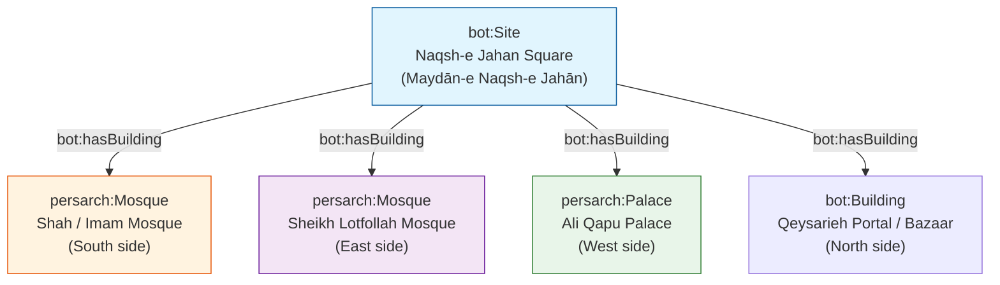
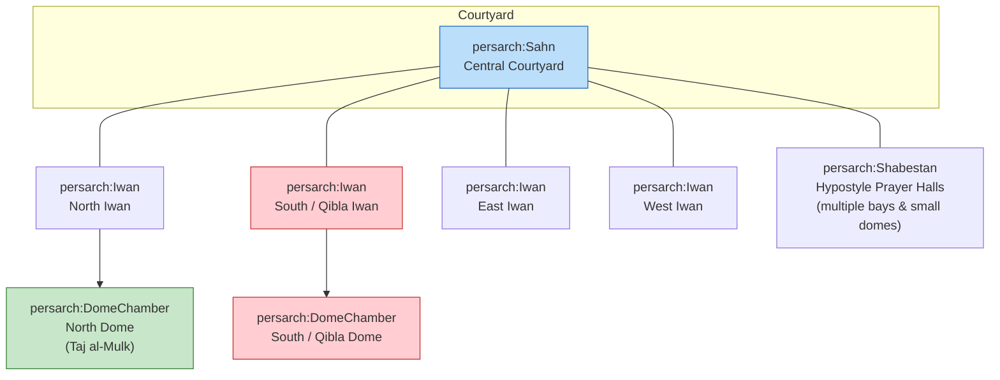
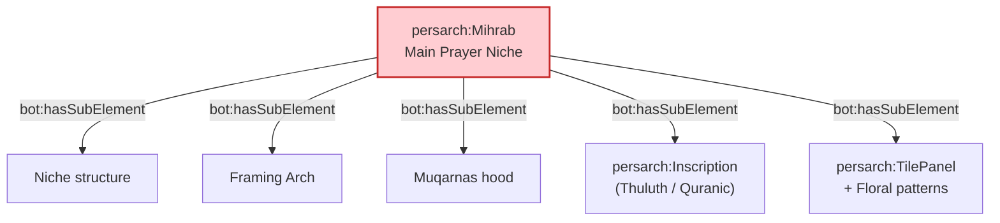

# Persian Architecture Ontology – BOT Extension Case Studies

**Extending the Building Topology Ontology (BOT) for Persian / Iranian Islamic Architecture**  
Focus: Masjid-i Jāmiʿ of Isfahan · Sheikh Lotfollah Mosque · Naqsh-e Jahan Square Ensemble

[](https://creativecommons.org/licenses/by/4.0/)
[](https://www.w3.org/OWL/)
[-green)](https://w3c-lbd-cg.github.io/bot/)

---

## 1. Project Vision

This repository provides a practical, reusable extension of the **Building Topology Ontology (BOT)** tailored to the distinctive spatial, structural, decorative, and typological features of Persian architecture.  

It demonstrates how a minimal, standards-compliant topological core can be systematically enriched to support:

- Digital documentation of historic mosques, madrasas, caravanserais, and urban ensembles
- Knowledge-graph construction for cultural heritage
- SPARQL querying of spaces, elements, inscriptions, and motifs
- Integration with IIIF, GeoSPARQL (WKT), Getty AAT, and CIDOC-CRM / CRMtex
- Future AI / GraphRAG applications over architectural heritage data

The work follows a deliberate iterative strategy: start from BOT’s core classes and properties, then expand according to clear priorities and real case studies.

### Primary Case Studies

| Case Study | Type | Key Characteristics | Modelling Focus |
|------------|------|---------------------|-----------------|
| **Naqsh-e Jahan Square** | `bot:Site` | UNESCO World Heritage (1979). ~160 × 560 m. Safavid urban ensemble (1598–1629) under Shah Abbas I | Site-level containment, adjacency of multiple buildings |
| **Masjid-i Jāmiʿ (Friday / Great Mosque)** | Large multi-period `bot:Building` | Prototype four-iwan plan. Continuous construction from 8th–19th centuries. Eric Schroeder 1931 numbered plan | Hierarchical spaces, multi-phase complexity, numbered spatial inventory |
| **Sheikh Lotfollah Mosque** | Compact Safavid `bot:Building` | 1602/03–1618/19. Architect: Muhammad Reza Isfahani. Single rotated dome chamber, no courtyard, no minarets | Precise spatial sequence, qibla orientation, rich surface decoration |
| **Shah Mosque (Imam Mosque)** & **Ali Qapu Palace** | Additional buildings on the same Site | Public congregational mosque vs. royal pavilion | Typological contrast within one urban setting |

---

## 2. Background: Why Extend BOT?

The **Building Topology Ontology (BOT)** is a lightweight OWL ontology developed by the W3C Linked Building Data Community Group. It defines only the essential topological concepts needed to describe buildings:

**Core Classes**  
`bot:Zone` · `bot:Site` · `bot:Building` · `bot:Storey` · `bot:Space` · `bot:Element` · `bot:Interface`

**Key Properties**  
`bot:containsZone` (transitive) · `bot:hasBuilding` · `bot:hasStorey` · `bot:hasSpace`  
`bot:containsElement` · `bot:adjacentElement` · `bot:hasSubElement`  
`bot:adjacentZone` · `bot:intersectsZone` · `bot:interfaceOf`

BOT is deliberately minimal and designed for domain-specific extension through subclassing and sub-properties. Persian architecture requires additional concepts for:

- Building types (Mosque, Madrasa, Caravanserai, Palace)
- Characteristic spaces (Sahn / Courtyard, Iwan, Dome Chamber, Shabestan, Hujra, Pishtaq)
- Complex elements with internal structure (Mihrab, Minaret, Dome)
- Decorative systems (Tile panels, Floral / Arabesque patterns, Calligraphic inscriptions)
- Script styles (Thuluth, Kufic, …) and Quranic content
- Precise geometric placement (WKT / GeoSPARQL)
- Alignment with Getty AAT motifs and materials

This repository implements that extension under the namespace `persarch:` (Persian Architecture).

---

## 3. Ontology Extension Overview

### 3.1 High-Level Class Hierarchy

```mermaid
classDiagram
    direction TB
    class bot_Zone {
        <<BOT>>
    }
    class bot_Site {
        <<BOT>>
    }
    class bot_Building {
        <<BOT>>
    }
    class bot_Space {
        <<BOT>>
    }
    class bot_Element {
        <<BOT>>
    }

    bot_Zone <|-- bot_Site
    bot_Zone <|-- bot_Building
    bot_Zone <|-- bot_Space

    class persarch_Mosque
    class persarch_Palace
    class persarch_Madrasa
    class persarch_Caravanserai

    bot_Building <|-- persarch_Mosque
    bot_Building <|-- persarch_Palace
    bot_Building <|-- persarch_Madrasa
    bot_Building <|-- persarch_Caravanserai

    class persarch_Sahn
    class persarch_Iwan
    class persarch_DomeChamber
    class persarch_Shabestan
    class persarch_PishtaqSpace
    class persarch_Hujra

    bot_Space <|-- persarch_Sahn
    bot_Space <|-- persarch_Iwan
    bot_Space <|-- persarch_DomeChamber
    bot_Space <|-- persarch_Shabestan
    bot_Space <|-- persarch_PishtaqSpace
    bot_Space <|-- persarch_Hujra

    class persarch_Mihrab
    class persarch_Minaret
    class persarch_Dome
    class persarch_SurfaceDecoration
    class persarch_Inscription
    class persarch_TilePanel
    class persarch_FloralPattern

    bot_Element <|-- persarch_Mihrab
    bot_Element <|-- persarch_Minaret
    bot_Element <|-- persarch_Dome
    bot_Element <|-- persarch_SurfaceDecoration
    persarch_SurfaceDecoration <|-- persarch_Inscription
    persarch_SurfaceDecoration <|-- persarch_TilePanel
    persarch_SurfaceDecoration <|-- persarch_FloralPattern
```



### 3.2 Key Modelling Decisions

| Decision | Rationale |
|----------|-----------|
| Mihrab and Minaret as `bot:Element` | They are discrete architectural constituents with clear function and form. Complexity is captured via `bot:hasSubElement`. |
| Sub-elements for complex components | BOT explicitly supports `bot:hasSubElement` (e.g. wall hosts window). A minaret base, shaft, balcony, lantern, internal stair, and inscription bands are natural sub-elements. |
| Surface decorations as Elements | Tile panels, floral patterns, and inscriptions are attached to parent elements (walls, domes, mihrabs) and can carry their own geometry (WKT) and AAT alignments. |
| Numbered spaces from Schroeder plan | Preserve the original scholarly numbering as stable identifiers while mapping each number to a typed `persarch:` Space. |
| Site = Naqsh-e Jahan Square | Demonstrates multi-building urban topology while remaining fully BOT-compliant. |

---

## 4. Case Study 1 – Naqsh-e Jahan Square as `bot:Site`

**Historical context**  
Laid out under Shah Abbas I (construction period approximately 1598–1629). UNESCO World Heritage Site (inscribed 1979, criteria i, v, vi). Dimensions approximately 160 m × 560 m (area ≈ 89,600 m²).

**Major buildings on the Site**



This structure allows queries such as:  
“Return all mosques contained in the Naqsh-e Jahan Site” or “Find buildings adjacent to the Shah Mosque across the square.”

---

## 5. Case Study 2 – Masjid-i Jāmiʿ of Isfahan (Friday Mosque)

### 5.1 Architectural Significance

- One of the oldest and most continuously evolved congregational mosques in Iran.
- Transformed under the Seljuks into the classic four-iwan courtyard plan that became the prototype for later Persian mosques.
- Contains two celebrated dome chambers: the southern qibla dome (associated with Nizam al-Mulk) and the northern dome (Taj al-Mulk, 1088–89).
- Later additions from Ilkhanid, Timurid, Safavid, and Qajar periods create a rich stratigraphy of styles and spaces.

### 5.2 Eric Schroeder’s 1931 Plan – A Pioneering Structural Inventory

In 1931 Eric Schroeder produced a meticulously numbered ground plan of the Masjid-i Jāmiʿ of Isfahan for the **American Institute for Persian Art and Archaeology**, the organisation closely associated with Arthur Upham Pope. The original drawing is preserved in the Ernst Herzfeld Papers at the National Museum of Asian Art Archives, Smithsonian Institution (Item D-704 / FSA A.06 05.0704). The verso caption reads: “Plan of MASJID-I-JAMI' of ISFAHAN. drawn by Eric Schroeder for the American Institute for Persian Art and Archaeology, 1931.”

This was not merely a conventional architectural survey drawing. By systematically numbering every space, bay, iwan, dome chamber, and secondary structure, Schroeder created what can be understood as an early form of **structured spatial data**. At a time when most documentation of Islamic architecture still relied on descriptive prose, selective photographs, or un-numbered sketches, the decision to assign unique identifiers to the constituent parts of this vast, multi-period complex was a conceptual leap. It implicitly treated the mosque as a system of discrete, referenceable units — exactly the kind of decomposition that modern topological ontologies (BOT and its extensions) formalise.

The intellectual value of this approach was quickly recognised. Later researchers, including Albert Gabriel (whose 1935 study of the mosque appeared in *Ars Islamica*) and especially Eugenio Galdieri (whose multi-volume IsMEO publications of the 1970s–1980s remain foundational), worked within and built upon the spatial framework that Schroeder and the Pope circle had established. The numbered plan became a shared reference that allowed successive generations of scholars to discuss individual spaces with precision rather than ambiguity.

In the present project we treat Schroeder’s numbering as a primary scholarly authority. Each numbered area is modelled as a `bot:Space` (or a more specific subclass such as `persarch:Iwan`, `persarch:DomeChamber`, or `persarch:Shabestan`) while the original number is retained as a stable identifier. This preserves the historical integrity of the 1931 survey and simultaneously converts it into machine-readable topological data.

**Embedding the original drawing**  
A published version of the plan is available on ArchNet:  
)  


For the repository we recommend:
- Hosting a high-resolution scan (or a carefully prepared derivative) in the `media/` folder, with clear attribution to Schroeder / American Institute for Persian Art and Archaeology / Smithsonian archival source.
- Linking to the ArchNet record and the Smithsonian catalogue entry.
- Respecting any applicable rights; the Smithsonian record notes that permission is required for reproduction beyond fair scholarly use.

**Toward a vector version**  
One of the longer-term goals of this case study is to produce a clean vector redrawing of Schroeder’s plan (SVG or layered CAD) that:
- Retains every original number,
- Makes each numbered space a discrete, selectable object,
- Can be aligned with modern survey data or photogrammetric models,
- Serves as a visual and computational bridge between the 1931 inventory and the RDF instance data.

Such a vector layer would allow the numbered spaces to be linked directly to `bot:Space` individuals, enabling both human reading of the historic plan and machine querying of the ontology. This continues, in digital form, the very impulse that made Schroeder’s original drawing so far-sighted.

### 5.3 Four-Iwan Spatial Organisation (Simplified)



The southern iwan is deliberately larger and leads into the main dome chamber, reinforcing the qibla direction.

---

## 6. Case Study 3 – Sheikh Lotfollah Mosque

### 6.1 Key Facts

| Attribute | Value |
|-----------|-------|
| Construction | Started 1011 AH (1602/1603 CE) – Completed 1028 AH (1618/1619 CE) |
| Patron | Shah Abbas I |
| Architect | Muhammad Reza Isfahani (son of Husayn) |
| Location | East side of Naqsh-e Jahan Square |
| Type | Private royal mosque (no public courtyard, no minarets) |
| Dome chamber | Approx. 19 m per side |
| Outer dome height | Approx. 32 m |
| Outer dome diameter | Approx. 22 m |
| Special feature | 45° rotation of the prayer hall relative to the entrance axis to achieve correct qibla orientation |

### 6.2 Spatial Sequence

The building is a masterpiece of controlled spatial experience. The visitor moves from the grand square through a portal, then along a carefully angled corridor that reorients the body toward the qibla before entering the single, luminous dome chamber.


This sequence is an excellent test case for ordered spatial relationships and for modelling orientation properties (`persarch:orientedToQibla`).

### 6.3 Element Decomposition Example – Mihrab



The same pattern applies to the dome (squinches, drum, shell, interior tile registers) and, where present, to minarets.

---

## 7. Decorative Layer – Patterns, Inscriptions & AAT

Surface decorations are modelled as subclasses of `bot:Element` so they can be attached to parent elements and carry their own geometry and controlled vocabulary links.

**Core classes**
- `persarch:SurfaceDecoration`
- `persarch:TilePanel`
- `persarch:FloralPattern`
- `persarch:Inscription`

**Key properties**
- `persarch:decorates` / `persarch:locatedOn` (sub-properties of BOT relations)
- `persarch:hasScriptStyle` (Thuluth, Kufic, …)
- `persarch:hasText` (Arabic original + optional translations)
- `persarch:referencesQuranicVerse`
- `persarch:hasMotifType` → Getty AAT concepts (e.g. arabesques `aat:300010206`, lotus motif, etc.)
- `persarch:hasSurfaceGeometry` → GeoSPARQL / WKT for precise placement on surfaces

This layer enables both art-historical analysis and computational extraction of Quranic text from inscriptions together with their exact location in the building.

---

## 8. Repository Structure (Recommended)

```
persian-architecture-bot-case-studies/
├── ontology/
│   ├── persarch.ttl                 # Core extension
│   ├── alignments/                  # AAT, GeoSPARQL, CRMtex, …
│   └── shapes/                      # Optional SHACL
├── data/
│   ├── naqsh-e-jahan-site.ttl
│   ├── masjid-i-jami.ttl            # Schroeder-numbered spaces
│   ├── sheikh-lotfollah.ttl
│   ├── shah-mosque.ttl
│   └── ali-qapu.ttl
├── queries/
│   └── competency-questions.rq
├── docs/
│   ├── modelling-decisions.md
│   └── diagrams/                    # Additional Mermaid / images
├── media/
│   └── (links or rights-cleared images of plans)
└── README.md                        # This file
```

---

## 9. Competency Questions the Model Answers

1. Which buildings are contained in the Naqsh-e Jahan Site?
2. List all spaces of type `persarch:Iwan` in the Masjid-i Jāmiʿ and preserve their Schroeder numbers.
3. What is the spatial sequence from the portal of Sheikh Lotfollah Mosque to its mihrab?
4. Which sub-elements belong to a given mihrab or minaret?
5. Retrieve all Thuluth inscriptions that reference a Quranic verse and return their WKT placement.
6. Find all tile panels whose motif type is aligned to a specific Getty AAT concept (e.g. arabesque).

---

## 10. Data Sources & Scholarly Grounding

- Eric Schroeder, Plan of Masjid-i Jāmiʿ of Isfahan, 1931 (American Institute for Persian Art and Archaeology). Smithsonian Institution, Ernst Herzfeld Papers, D-704.
- UNESCO World Heritage documentation for Naqsh-e Jahan Square (Reference 115).
- Standard architectural literature on Safavid Isfahan (Shah Mosque, Sheikh Lotfollah, Ali Qapu).
- BOT specification: https://w3c-lbd-cg.github.io/bot/
- Getty Art & Architecture Thesaurus (AAT) for motif and material alignment.

All modelling decisions prioritise fidelity to these primary sources while remaining computationally useful.

---

## 11. Next Steps & Contribution

1. Formalise the full `persarch.ttl` ontology module.
2. Populate instance data for the three main buildings, starting with the numbered spaces of the Schroeder plan and the complete spatial sequence of Sheikh Lotfollah.
3. Add sample SPARQL queries and a Jupyter / Observable notebook.
4. Align key decorative motifs to Getty AAT and experiment with WKT surface geometries.
5. Optionally link IIIF manifests of historic photographs and plans.

Contributions that improve accuracy, add bilingual (Persian/English) labels, expand the instance data, or provide additional SHACL shapes are warmly welcome.

---

## 12. Citation

If you use this work, please cite the repository and acknowledge the underlying scholarly sources (especially Schroeder’s 1931 plan and the UNESCO documentation of Naqsh-e Jahan Square).

---

**Status**: Active development – foundational modelling and case-study design complete.  
**Maintainer**: [Your GitHub handle]  
**License**: Creative Commons Attribution 4.0 International (CC BY 4.0) for documentation; ontology files under an open ontology-friendly license (to be confirmed).

This repository is intended both as a practical tool for digital cultural heritage and as a clear, diagram-rich source that tools such as Google NotebookLM can use to generate slide decks and infographics about the extension of BOT to Persian architecture.
