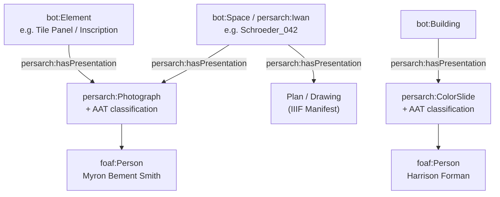
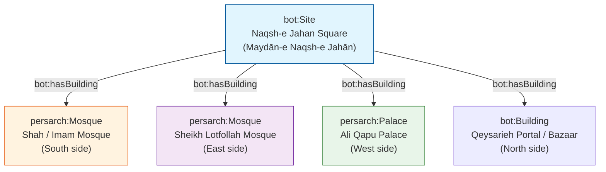
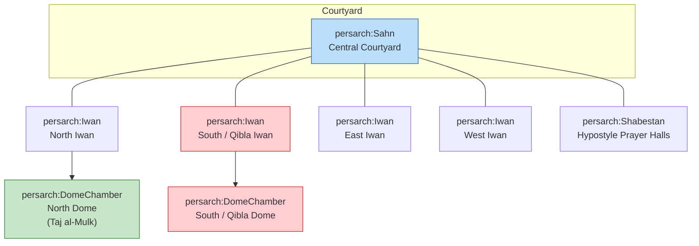
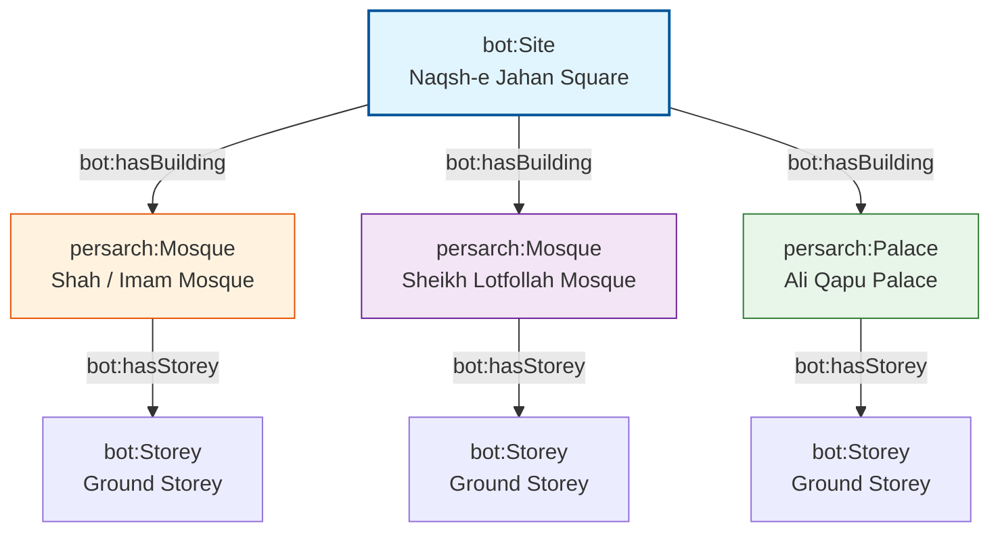
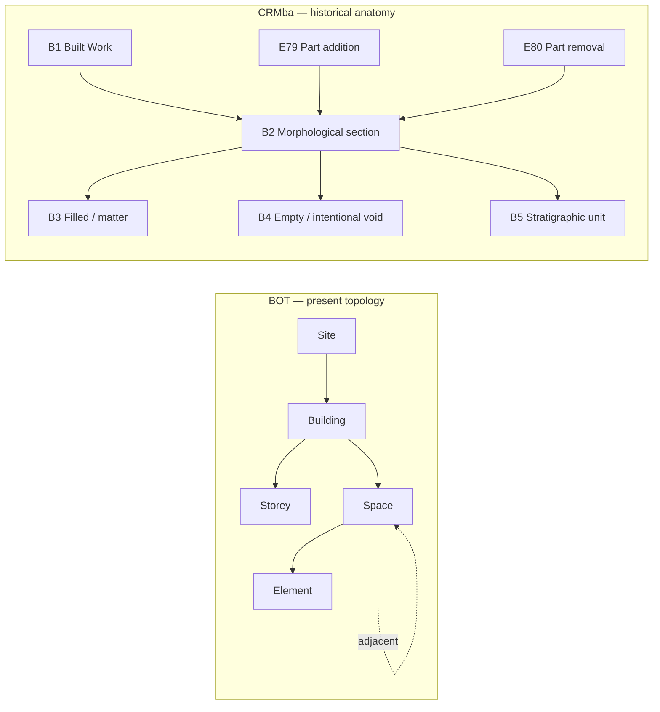
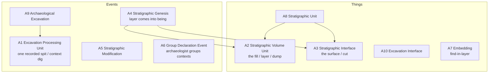

# Persian Architecture Ontology – BOT Extension Case Studies

**Extending the Building Topology Ontology (BOT) for Persian / Iranian Islamic Architecture**  
Focus: Masjid-i Jāmiʿ of Isfahan · Sheikh Lotfollah Mosque · Naqsh-e Jahan Square Ensemble

[](https://www.gnu.org/licenses/gpl-3.0)
[](https://www.w3.org/OWL/)
[-green)](https://w3c-lbd-cg.github.io/bot/)

---

## 1. Project Vision

This repository provides a practical, reusable extension of the **Building Topology Ontology (BOT)** tailored to the distinctive spatial, structural, decorative, and typological features of Persian architecture.  


It demonstrates how a minimal, standards-compliant topological core can be systematically enriched to support:

- Digital documentation of historic mosques, madrasas, caravanserais, and urban ensembles
- Knowledge-graph construction for cultural heritage
- SPARQL querying of spaces, elements, inscriptions, and motifs
- Integration with IIIF, GeoSPARQL (WKT), Getty AAT, and CIDOC-CRM / CRMtex
- Future AI / GraphRAG applications over architectural heritage data

The work follows a deliberate iterative strategy: start from BOT’s core classes and properties, then expand according to clear priorities and real case studies.

### Primary Case Studies

| Case Study | Type | Key Characteristics | Modelling Focus |
|------------|------|---------------------|-----------------|
| **Naqsh-e Jahan Square** | `bot:Site` | UNESCO World Heritage (1979). ~160 × 560 m. Safavid urban ensemble (1598–1629) under Shah Abbas I | Site-level containment, adjacency of multiple buildings |
| **Masjid-i Jāmiʿ (Friday / Great Mosque)** | Large multi-period `bot:Building` | Prototype four-iwan plan. Continuous construction from 8th–19th centuries. Eric Schroeder 1931 numbered plan | Hierarchical spaces, multi-phase complexity, numbered spatial inventory |
| **Sheikh Lotfollah Mosque** | Compact Safavid `bot:Building` | 1602/03–1618/19. Architect: Muhammad Reza Isfahani. Single rotated dome chamber, no courtyard, no minarets | Precise spatial sequence, qibla orientation, rich surface decoration |
| **Shah Mosque (Imam Mosque)** & **Ali Qapu Palace** | Additional buildings on the same Site | Public congregational mosque vs. royal pavilion | Typological contrast within one urban setting |

---

## 2. Background: Why Extend BOT?

The **Building Topology Ontology (BOT)** is a lightweight OWL ontology developed by the W3C Linked Building Data Community Group. It defines only the essential topological concepts needed to describe buildings:

**Core Classes**  
`bot:Zone` · `bot:Site` · `bot:Building` · `bot:Storey` · `bot:Space` · `bot:Element` · `bot:Interface`

**Key Properties**  
`bot:containsZone` (transitive) · `bot:hasBuilding` · `bot:hasStorey` · `bot:hasSpace`  
`bot:containsElement` · `bot:adjacentElement` · `bot:hasSubElement`  
`bot:adjacentZone` · `bot:intersectsZone` · `bot:interfaceOf`

BOT is deliberately minimal and designed for domain-specific extension through subclassing and sub-properties. Persian architecture requires additional concepts for:

- Building types (Mosque, Madrasa, Caravanserai, Palace)
- Characteristic spaces (Sahn / Courtyard, Iwan, Dome Chamber, Shabestan, Hujra, Pishtaq)
- Complex elements with internal structure (Mihrab, Minaret, Dome)
- Decorative systems (Tile panels, Floral / Arabesque patterns, Calligraphic inscriptions)
- Script styles (Thuluth, Kufic, …) and Quranic content
- Precise geometric placement (WKT / GeoSPARQL)
- Alignment with Getty AAT motifs and materials

This repository implements that extension under the namespace `persarch:` (Persian Architecture).

---

## 3. Ontology Extension Overview

### 3.1 High-Level Class Hierarchy

```mermaid
classDiagram
    direction TB

    class bot_Zone {
        <<BOT>>
    }
    class bot_Site {
        <<BOT>>
    }
    class bot_Building {
        <<BOT>>
    }
    class bot_Space {
        <<BOT>>
    }
    class bot_Element {
        <<BOT>>
    }

    bot_Zone <|-- bot_Site
    bot_Zone <|-- bot_Building
    bot_Zone <|-- bot_Space

    class persarch_Mosque
    class persarch_Palace
    class persarch_Madrasa
    class persarch_Caravanserai

    bot_Building <|-- persarch_Mosque
    bot_Building <|-- persarch_Palace
    bot_Building <|-- persarch_Madrasa
    bot_Building <|-- persarch_Caravanserai

    class persarch_Sahn
    class persarch_Iwan
    class persarch_DomeChamber
    class persarch_Shabestan
    class persarch_PishtaqSpace
    class persarch_Hujra

    bot_Space <|-- persarch_Sahn
    bot_Space <|-- persarch_Iwan
    bot_Space <|-- persarch_DomeChamber
    bot_Space <|-- persarch_Shabestan
    bot_Space <|-- persarch_PishtaqSpace
    bot_Space <|-- persarch_Hujra

    class persarch_Mihrab
    class persarch_Minaret
    class persarch_Dome
    class persarch_SurfaceDecoration
    class persarch_Inscription
    class persarch_TilePanel
    class persarch_FloralPattern

    bot_Element <|-- persarch_Mihrab
    bot_Element <|-- persarch_Minaret
    bot_Element <|-- persarch_Dome
    bot_Element <|-- persarch_SurfaceDecoration
    persarch_SurfaceDecoration <|-- persarch_Inscription
    persarch_SurfaceDecoration <|-- persarch_TilePanel
    persarch_SurfaceDecoration <|-- persarch_FloralPattern

    %% New media / presentation layer
    class persarch_PresentationResource {
        <<Media>>
    }
    class persarch_Photograph
    class persarch_ColorSlide
    class persarch_PlanImage

    persarch_PresentationResource <|-- persarch_Photograph
    persarch_PresentationResource <|-- persarch_ColorSlide
    persarch_PresentationResource <|-- persarch_PlanImage

    bot_Zone --> persarch_PresentationResource : hasPresentation
    bot_Element --> persarch_PresentationResource : hasPresentation
```



Separate visual Layer



### 3.2 Key Modelling Decisions

| Decision | Rationale |
|----------|-----------|
| Mihrab and Minaret as `bot:Element` | They are discrete architectural constituents with clear function and form. Complexity is captured via `bot:hasSubElement`. |
| Sub-elements for complex components | BOT explicitly supports `bot:hasSubElement` (e.g. wall hosts window). A minaret base, shaft, balcony, lantern, internal stair, and inscription bands are natural sub-elements. |
| Surface decorations as Elements | Tile panels, floral patterns, and inscriptions are attached to parent elements (walls, domes, mihrabs) and can carry their own geometry (WKT) and AAT alignments. |
| Numbered spaces from Schroeder plan | Preserve the original scholarly numbering as stable identifiers while mapping each number to a typed `persarch:` Space. |
| Site = Naqsh-e Jahan Square | Demonstrates multi-building urban topology while remaining fully BOT-compliant. |

---

## 4. Case Study 1 – Naqsh-e Jahan Square as `bot:Site`

**Historical context**  
Laid out under Shah Abbas I (construction period approximately 1598–1629). UNESCO World Heritage Site (inscribed 1979, criteria i, v, vi). Dimensions approximately 160 m × 560 m (area ≈ 89,600 m²).

**Major buildings on the Site**



This structure allows queries such as:  
“Return all mosques contained in the Naqsh-e Jahan Site” or “Find buildings adjacent to the Shah Mosque across the square.”

---

## 5. Case Study – Masjid-i Jāmiʿ of Isfahan (Friday Mosque) with Schroeder Numbers

### 5.1 Architectural Significance

- One of the oldest and most continuously evolved congregational mosques in Iran.
- Transformed under the Seljuks into the classic four-iwan courtyard plan that became the prototype for later Persian mosques.
- Contains two celebrated dome chambers: the southern qibla dome (associated with Nizam al-Mulk) and the northern dome (Taj al-Mulk, 1088–89).
- Later additions from Ilkhanid, Timurid, Safavid, and Qajar periods create a rich stratigraphy of styles and spaces.

### 5.2 Eric Schroeder’s 1931 Plan – A Pioneering Structural Inventory

In 1931 Eric Schroeder produced a meticulously numbered ground plan of the Masjid-i Jāmiʿ of Isfahan for the **American Institute for Persian Art and Archaeology**, the organisation closely associated with Arthur Upham Pope. The original drawing is preserved in the Ernst Herzfeld Papers at the National Museum of Asian Art Archives, Smithsonian Institution (Item D-704 / FSA A.06 05.0704). The verso caption reads: “Plan of MASJID-I-JAMI' of ISFAHAN. drawn by Eric Schroeder for the American Institute for Persian Art and Archaeology, 1931.”

This was not merely a conventional architectural survey drawing. By systematically numbering every space, bay, iwan, dome chamber, and secondary structure, Schroeder created what can be understood as an early form of **structured spatial data**. At a time when most documentation of Islamic architecture still relied on descriptive prose, selective photographs, or un-numbered sketches, the decision to assign unique identifiers to the constituent parts of this vast, multi-period complex was a conceptual leap. It implicitly treated the mosque as a system of discrete, referenceable units — exactly the kind of decomposition that modern topological ontologies (BOT and its extensions) formalise.

The intellectual value of this approach was quickly recognised. Later researchers, including Albert Gabriel (whose 1935 study of the mosque appeared in *Ars Islamica*) and especially Eugenio Galdieri (whose multi-volume IsMEO publications of the 1970s–1980s remain foundational), worked within and built upon the spatial framework that Schroeder and the Pope circle had established. The numbered plan became a shared reference that allowed successive generations of scholars to discuss individual spaces with precision rather than ambiguity.

In the present project we treat Schroeder’s numbering as a primary scholarly authority. Each numbered area is modelled as a `bot:Space` (or a more specific subclass such as `persarch:Iwan`, `persarch:DomeChamber`, or `persarch:Shabestan`) while the original number is retained as a stable identifier. This preserves the historical integrity of the 1931 survey and simultaneously converts it into machine-readable topological data.

**Embedding the original drawing**  
A published version of the plan is available on ArchNet:  
[https://www.archnet.org/sites/1621?media_content_id=62965](https://www.archnet.org/sites/1621?media_content_id=62965)  
(Title on ArchNet: “Isfahan. Friday Mosque. Plan. Schroeder.”)

**Toward a vector version**  
One of the longer-term goals is to produce a clean vector redrawing (SVG) that retains every original number as a discrete, selectable object that can be linked directly to `bot:Space` individuals.

### 5.3 Sample Instance Data – South Iwan and Southern Dome Chamber

The following Turtle illustrates the recommended pattern: Schroeder number as stable identifier, domain typing, adjacency, and illustrative WKT geometry (local coordinate system – replace with surveyed values later).


#### Classifying the Media Resources with AAT

Treat every photograph or slide as a first-class resource that can be typed and classified:

| Concept | Suggested AAT alignment | Notes |
|---------|-------------------------|-------|
| Black-and-white photograph | `aat:300128343` (black-and-white photographs) or broader `aat:300046300` (photographs) | Myron Bement Smith material |
| Color slide | `aat:300128359` (color slides) | Harrison Forman material |
| Architectural photograph | Can combine with subject terms | |
| Subject matter | Use AAT for “inscriptions”, “tilework”, “arabesques / floral patterns”, “iwans”, etc. | Enables cross-collection discovery |

Agents (photographers) become reusable nodes:

- `Myron Bement Smith` (1897–1970) — major documentation of the Masjid-i Jāmiʿ, including detailed views of the Qibla iwan.
- `Harrison Forman` (1904–1978) — 1967 colour slides of the Great Mosque and related Isfahan monuments (many already have IIIF manifests at UWM Libraries).


```turtle
@prefix bot:      <https://w3id.org/bot#> .
@prefix persarch: <https://w3id.org/persian-architecture#> .
@prefix geo:      <http://www.opengis.net/ont/geosparql#> .
@prefix rdfs:     <http://www.w3.org/2000/01/rdf-schema#> .
@prefix xsd:      <http://www.w3.org/2001/XMLSchema#> .
@prefix dcterms:  <http://purl.org/dc/terms/> .

persarch:hasPresentation a owl:ObjectProperty ;
    rdfs:label "has presentation"@en ;
    rdfs:comment "Links any architectural zone or element to an IIIF Presentation resource (Manifest or Canvas) that depicts or documents it."@en ;
    rdfs:domain bot:Zone ;          # or a union of bot:Zone and bot:Element
    rdfs:range  persarch:PresentationResource .

# Optional, more precise sub-properties (use if you want stronger semantics)
persarch:hasPlanPresentation     rdfs:subPropertyOf persarch:hasPresentation .
persarch:hasPhotographPresentation rdfs:subPropertyOf persarch:hasPresentation .
persarch:hasSlidePresentation    rdfs:subPropertyOf persarch:hasPresentation .

:Masjid_i_Jami a persarch:Mosque , bot:Building ;
    rdfs:label "Masjid-i Jāmiʿ of Isfahan"@en ;
    rdfs:label "مسجد جامع اصفهان"@fa ;
    dcterms:source <https://www.archnet.org/sites/1621?media_content_id=62965> ;
    dcterms:source <https://www.si.edu/object/archives/components/sova-fsa-a-06-ref24401>
    dcterms:description "The Friday Mosque of Isfahan (Great Mosque). Multi-period complex documented in Eric Schroeder’s 1931 numbered plan."@en .

# South / Qibla Iwan (illustrative Schroeder number 42)
:Schroeder_042 a persarch:Iwan , bot:Space ;
    rdfs:label "South Iwan (Qibla Iwan)"@en ;
    rdfs:label "ایوان جنوبی (ایوان قبله)"@fa ;
    persarch:schroederNumber "42"^^xsd:string ;
    rdfs:comment "Main qibla-oriented iwan on the southern side of the central courtyard. Numbered 42 on Eric Schroeder’s 1931 plan."@en ;
    bot:adjacentZone :Schroeder_055 ;
    geo:hasGeometry :Geom_Schroeder_042 ;
    persarch:hasIIIFManifest <https://example.org/iiif/smith-qibla-iwan/manifest.json> .

:Geom_Schroeder_042 a geo:Geometry ;
    geo:asWKT """POLYGON((45.2 12.8, 58.7 12.8, 58.7 28.4, 45.2 28.4, 45.2 12.8))"""^^geo:wktLiteral ;
    rdfs:comment "Illustrative WKT in a local metric coordinate system. Replace with accurate surveyed coordinates."@en .

# Southern Dome Chamber
:Schroeder_055 a persarch:DomeChamber , bot:Space ;
    rdfs:label "Southern Dome Chamber (Qibla Dome)"@en ;
    rdfs:label "گنبدخانه جنوبی (گنبد قبله)"@fa ;
    persarch:schroederNumber "55"^^xsd:string ;
    rdfs:comment "The main southern dome chamber behind the qibla iwan."@en ;
    bot:adjacentZone :Schroeder_042 ;
    geo:hasGeometry :Geom_Schroeder_055 .

:Geom_Schroeder_055 a geo:Geometry ;
    geo:asWKT """POLYGON((46.1 28.4, 57.9 28.4, 57.9 41.6, 46.1 41.6, 46.1 28.4))"""^^geo:wktLiteral .

:Masjid_i_Jami bot:hasSpace :Schroeder_042 , :Schroeder_055 .

# A vintage B&W photograph by Myron Bement Smith
:Photo_Smith_Qibla_Iwan_Tiles a persarch:Photograph , foaf:Document ;
    rdfs:label "Detail of tilework and inscriptions, Qibla Iwan, Masjid-i Jāmiʿ"@en ;
    dcterms:creator :Myron_Bement_Smith ;
    dcterms:date "1930s" ;                     # approximate; refine when known
    aat:300128343 aat:300128343 ;              # black-and-white photographs
    # subject classification
    dcterms:subject aat:300010206 ;            # arabesques (example)
    dcterms:subject aat:300028704 ;            # inscriptions (or more precise term)
    persarch:depicts :Schroeder_042 ;
    # IIIF link
    persarch:hasIIIFManifest <https://example.org/iiif/smith-qibla-iwan/manifest.json> ;
    # or directly a Canvas if preferred

# A colour slide by Harrison Forman (real IIIF example exists at UWM)
:Slide_Forman_Great_Mosque a persarch:ColorSlide , foaf:Document ;
    rdfs:label "Great Mosque of Isfahan (Masjid-i Juma), 1967"@en ;
    dcterms:creator :Harrison_Forman ;
    dcterms:date "1967"^^xsd:gYear ;
    aat:300128359 aat:300128359 ;              # color slides
    persarch:depicts :Masjid_i_Jami ;
    persarch:hasIIIFManifest <https://collections.lib.uwm.edu/iiif/info/agsphoto/34594/manifest.json> .

# Linking from the space/building back to the media
:Schroeder_042 persarch:hasPhotographPresentation :Photo_Smith_Qibla_Iwan_Tiles .
:Masjid_i_Jami   persarch:hasSlidePresentation :Slide_Forman_Great_Mosque .

# Agents (reusable nodes)
:Myron_Bement_Smith a foaf:Person ;
    rdfs:label "Myron Bement Smith"@en ;
    foaf:birthDate "1897" ;
    foaf:deathDate "1970" .

:Harrison_Forman a foaf:Person ;
    rdfs:label "Harrison Forman"@en ;
    foaf:birthDate "1904" ;
    foaf:deathDate "1978" .

```

### 5.4 Four-Iwan Spatial Organisation (Simplified)



---

## 6. Case Study – Naqsh-e Jahan Square as a Large 3D Site

Naqsh-e Jahan Square is modelled as a single `bot:Site` that contains three major buildings. Each building is given at least one `bot:Storey` (Ground Storey) that in turn contains its principal spaces. This demonstrates multi-building urban topology while remaining fully BOT-compliant and ready for later 3D enrichment.

### 6.1 Site Hierarchy Overview



### 6.2 Sample Instance Data – Site + Three Buildings with Ground Storeys

```turtle
@prefix bot:      <https://w3id.org/bot#> .
@prefix persarch: <https://w3id.org/persian-architecture#> .
@prefix rdfs:     <http://www.w3.org/2000/01/rdf-schema#> .
@prefix dcterms:  <http://purl.org/dc/terms/> .
@prefix geo:      <http://www.opengis.net/ont/geosparql#> .

#################################################################
# The Site
#################################################################

:Naqsh_e_Jahan_Square a bot:Site ;
    rdfs:label "Naqsh-e Jahan Square"@en ;
    rdfs:label "میدان نقش جهان"@fa ;
    dcterms:description "UNESCO World Heritage Site (1979). Safavid urban ensemble laid out under Shah Abbas I (approx. 1598–1629). Dimensions ~160 × 560 m."@en ;
    bot:hasBuilding :Shah_Mosque ,
                    :Sheikh_Lotfollah_Mosque ,
                    :Ali_Qapu_Palace .

#################################################################
# 1. Shah Mosque (Imam Mosque) – South side
#################################################################

:Shah_Mosque a persarch:Mosque , bot:Building ;
    rdfs:label "Shah Mosque (Imam Mosque)"@en ;
    rdfs:label "مسجد شاه (مسجد امام)"@fa ;
    bot:hasStorey :Shah_Ground_Storey .

:Shah_Ground_Storey a bot:Storey ;
    rdfs:label "Ground Storey – Shah Mosque"@en ;
    bot:hasSpace :Shah_Sahn ,
                 :Shah_South_Iwan ,
                 :Shah_Dome_Chamber .

:Shah_Sahn a persarch:Sahn , bot:Space ;
    rdfs:label "Central Courtyard (Sahn)"@en .

:Shah_South_Iwan a persarch:Iwan , bot:Space ;
    rdfs:label "South / Qibla Iwan"@en ;
    bot:adjacentZone :Shah_Dome_Chamber .

:Shah_Dome_Chamber a persarch:DomeChamber , bot:Space ;
    rdfs:label "Main Dome Chamber"@en .

#################################################################
# 2. Sheikh Lotfollah Mosque – East side
#################################################################

:Sheikh_Lotfollah_Mosque a persarch:Mosque , bot:Building ;
    rdfs:label "Sheikh Lotfollah Mosque"@en ;
    rdfs:label "مسجد شیخ لطف‌الله"@fa ;
    bot:hasStorey :Lotfollah_Ground_Storey .

:Lotfollah_Ground_Storey a bot:Storey ;
    rdfs:label "Ground Storey – Sheikh Lotfollah"@en ;
    bot:hasSpace :Lotfollah_Portal ,
                 :Lotfollah_Corridor ,
                 :Lotfollah_Dome_Chamber .

:Lotfollah_Portal a persarch:PishtaqSpace , bot:Space ;
    rdfs:label "Entrance Portal (Pishtaq)"@en .

:Lotfollah_Corridor a bot:Space ;
    rdfs:label "Twisting Corridor (re-orientation sequence)"@en ;
    rdfs:comment "Corridor that rotates the visitor approximately 45° then 90° to align the prayer hall with the qibla."@en .

:Lotfollah_Dome_Chamber a persarch:DomeChamber , bot:Space ;
    rdfs:label "Main Prayer Hall / Dome Chamber"@en ;
    rdfs:comment "Single domed chamber (~19 m side). No courtyard, no minarets."@en .

#################################################################
# 3. Ali Qapu Palace – West side
#################################################################

:Ali_Qapu_Palace a persarch:Palace , bot:Building ;
    rdfs:label "Ali Qapu Palace"@en ;
    rdfs:label "عالی‌قاپو"@fa ;
    bot:hasStorey :AliQapu_Ground_Storey .

:AliQapu_Ground_Storey a bot:Storey ;
    rdfs:label "Ground Storey – Ali Qapu"@en ;
    bot:hasSpace :AliQapu_Entrance_Hall ,
                 :AliQapu_Reception .

:AliQapu_Entrance_Hall a bot:Space ;
    rdfs:label "Entrance Hall / Portal zone"@en .

:AliQapu_Reception a bot:Space ;
    rdfs:label "Ceremonial / Reception spaces"@en .
```

This structure is deliberately minimal yet complete. It can be expanded later with additional storeys (Ali Qapu is multi-storey), more detailed spaces, elements (mihrabs, minarets, tile panels), and real geometric data.

---

## 7. Decorative Layer – Patterns, Inscriptions & AAT

Surface decorations are modelled as subclasses of `bot:Element` so they can be attached to parent elements and carry their own geometry and controlled vocabulary links.

**Core classes**  
`persarch:SurfaceDecoration` · `persarch:TilePanel` · `persarch:FloralPattern` · `persarch:Inscription`

**Key properties**  
- `persarch:decorates` / `persarch:locatedOn`  
- `persarch:hasScriptStyle` (Thuluth, Kufic, …)  
- `persarch:hasText` + `persarch:referencesQuranicVerse`  
- `persarch:hasMotifType` → Getty AAT  
- `persarch:hasSurfaceGeometry` → GeoSPARQL / WKT  

---

## 8. Repository Structure (Recommended)

```
persian-architecture-bot-case-studies/
├── ontology/
│   ├── persarch.ttl
│   ├── alignments/
│   └── shapes/
├── data/
│   ├── naqsh-e-jahan-site.ttl
│   ├── masjid-i-jami.ttl          # Schroeder-numbered spaces
│   ├── sheikh-lotfollah.ttl
│   ├── shah-mosque.ttl
│   └── ali-qapu.ttl
├── queries/
│   └── competency-questions.rq
├── docs/
│   └── modelling-decisions.md
├── media/
│   └── (plans, images, vector SVG)
└── README.md
```

---


## 9. Why the event-centric core is correct

CRM does not treat a monument as a bag of attributes. It treats change as first-class. That matches the mosque:

- founding and Abbasid rebuild as `E12 Production`
- Seljuq four-iwan transformation, Ilkhanid two-storey courtyard, Timurid shabestān, Safavid replacement of parts of that shabestān as `E11 Modification`, usually specialised as `E79 Part Addition` or `E80 Part Removal`
- decoration campaigns (stucco mihrab, tile sheathing, muqarnas, inscriptions) as further `E12`/`E11` events whose products are features carried by the fabric

Each event then takes:

- `P4 has time-span` → `E52 Time-Span` (with `P82 at some time within`, `P81 ongoing throughout` when the sources only give a reign or a century)
- `P7 took place at` → `E53 Place`
- `P14 carried out by` → `E39 Actor` (`E21 Person` or `E74 Group`)
- `P108 has produced` / `P31 has modified` → the physical thing or feature that came into being or was altered

That is the right skeleton. Named actors already exist in the record: Neẓām-al-Molk and Tāj-al-Molk for the two Seljuq domes (1086 / 1088), Moḥammad Sāvi as patron and Badr as calligrapher-designer of the Öljeitü mihrab of 710/1310, Solṭān Moḥammad Bahādor for the Timurid hall of 851/1447, Uzun Ḥasan for courtyard tilework in 1475–76. Workshops and anonymous craftsmen should be `E74 Group` instances, not omitted. Patronage, design, execution, and later restoration are different roles (`P14.1 in the role of`), not one flattened “builder” property.

### Topological vs. Morphological points of view.

Better pattern, Introducing `CRMba` and `CRMarchaeo`

- one `E24 Physical Human-Made Thing` (or CRMba `B1 Built Work`) for the monument as a continuing identity
- that identity occupies an `E92 Spacetime Volume` whose spatial projection changes
- each morphologically coherent piece — south iwan, north dome chamber, Öljeitü prayer hall, winter shabestān, a specific inscription band — is its own `E24`/`E25`/`B2 Morphologic Building Section`
- `P46 is composed of` is used **phase-aware**, or better, composition is inferred from the events that added or removed parts

The Safavid destruction of parts of the Timurid shabestān is not a footnote. It is `E80 Part Removal` (or `E6 Destruction` of those components) with the removed matter optionally surviving as documented fragments. If you only assert “the mosque has a winter hall,” you erase the sequence that UNESCO and the Italian–Iranian excavations actually recovered.

Spaces of use (ṣahn, shabestān, madrasa, library, passage, rooftop) should not be conflated with fabric. A space is an `E53 Place` (or BOT `bot:Space`) *defined on* fabric at a time. Function is even more historical: the same volume can be hypostyle prayer hall, winter hall, or circulation. Encode function as time-bounded activities (`E7` “use of space X for Friday prayer”) or as `E13 Attribute Assignment`, not as a permanent type on the wall.

### BOT is useful, but it is not the heritage layer

BOT is a lean topology vocabulary: `Building`–`Storey`–`Space`–`Element`, containment and adjacency, optional 3D. It is excellent for linking a BIM/HBIM or point-cloud segmentation into RDF. It is **not** designed for standing-building stratigraphy, uncertain dating, or argumentation about phases.

For this mosque I would invert the stack:

| Layer | Role |
|---|---|
| CIDOC CRM | events, actors, time, provenance, information objects |
| CRMba | morphological sections, interfaces, building stratigraphy, part/whole through time |
| CRMarchaeo | excavated early phases (the 772 and 840–41 mosques under the Seljuq plan, different qibla) |
| CRMgeo | geometry, GeoSPARQL places, changing footprints |
| CRMtex | inscriptions as texts with carriers, scripts, reading events |
| CRMinf | competing attributions and dating hypotheses |
| BOT (+ IFC/LBD if you have a model) | current spatial topology and 3D navigation |
| AAT / ULAN / TGN / Wikidata | types, persons, places |

CRMba exists because CRM-base plus “has part” is too weak for a building that grew by cutting into older fabric. Jāmeʿ Isfahan is the textbook CRMba object: Seljuq brick core, Ilkhanid stucco inserted into it, Timurid colour over plain brick, Safavid muqarnas and minarets on the qibla iwan.

BOT can still sit beside this. Align `bot:Building` ≈ `B1`/`E24`, `bot:Space` ≈ a phase-specific `E53` or empty morphological section, `bot:Element` ≈ `E24`/`E25`. Do not let BOT become the historical ontology.

### AAT reconciliation is the right enrichment — if you type events and parts, not only objects

Getty AAT should type:

- building types and parts: mosque, four-iwan plan, iwan, pishtaq, minaret, mihrab, shabestān, muqarnas
- techniques and materials: glazed mosaic tile, haft rang, carved stucco, baked brick, kufic / thuluth / nastaʿlīq
- object types for movable or conceptually distinct works: inscription, tile panel

Bind them with `P2 has type`. Prefer AAT (and Wikidata as hub) over local string labels so the graph can join other mosque corpora.

Inscriptions need a second treatment. They are not only decoration. They are `E34 Inscription` (`P128 carries`) with language, script, transcription, and often a speech-act (foundation, Shiʿi hadith on the Öljeitü mihrab, patron’s name highlighted in colour). CRMtex is the clean extension here. That is how “Badr designed this” becomes a machine-readable claim rather than caption text.

### What will actually make or break the knowledge graph

**1. Event granularity policy.**  
One “Safavid era” mega-event will hide the fact that Shah ʿAbbās I largely ignored this mosque while other Safavid rulers tiled and restored it. One event per tile panel will explode the graph. A workable rule: one event per documented campaign that produced a coherent morphological or decorative unit, then optional sub-activities for named crafts.

**2. Identity of parts across modification.**  
Is the south iwan one thing continuously modified, or a Seljuq structure plus later vaults plus later tile skin? CRM allows both. For conservation and building archaeology, split skin from structure; for architectural history of type, keep the iwan as one `B2` with modification events. Record both readings if the project serves both communities.

**3. Uncertainty and disagreement.**  
Dates such as “Ilkhanid,” rival attributions, and reconstructed early orientations are interpretations. Put them behind `E13` or CRMinf beliefs with sources (`E31 Document`, ADAMJI archive, Honarfar, UNESCO dossier). A heritage KG that asserts every date as fact will be brittle.

**4. Mereology vs topology vs geometry.**  
`P46 is composed of` ≠ `bot:containsZone` ≠ GeoSPARQL `sfWithin`. Keep them distinct. Query “what was added to the western iwan before 1350?” should walk events, not only current IFC containment.

**5. Use and ritual, not only fabric.**  
Friday prayer, teaching, waqf administration, and later tourist/heritage use are `E7` activities. They are how “spaces with different usages” become historical, not just BIM room functions.

**6. Named vs anonymous labour.**  
Insist on groups (brick masons of campaign X, tile workshop of campaign Y). Otherwise the graph reproduces the usual elite-patron bias and loses the decorative programmes you rightly want to include.


### The two modelling moves that make the graph work

**1. One identity, many productions**

```turtle
jame:mosque a jame:MosqueComplex ;          # subclass of crmba:B1 + bot:Building
    crm:P2_has_type jame:type_mosque ;       # aat:300007544
    owl:sameAs wd:Q1256501 .

jame:evt_south_dome a crm:E12_Production ;
    crm:P4_has_time-span jame:ts_1086 ;
    jame:commissionedBy jame:actor_nizam_al_mulk ;
    crm:P108_has_produced jame:part_south_dome ;
    crm:P31_has_modified jame:mosque .
```

The mosque is not “built in 1086.” The *south dome* is produced in 1086; that event modifies the continuing built work.

**2. BOT for topology, CRM for history**

```turtle
jame:mosque
    bot:hasSpace  jame:space_sahn ;
    bot:hasElement jame:part_south_iwan .

jame:part_south_iwan
    crmba:BP1_is_section_of jame:mosque ;
    crm:P2_has_type jame:type_iwan .
```

`bot:hasElement` answers “what is in the building now?”  
`crmba:BP1` + events answer “which campaign created or altered this section?”  
Do not collapse those two relations.

### Roles without CRM’s awkward P14.1

In RDF, `P14.1 in the role of` needs a reified PC class. An application profile can do the same work with subproperties:

```turtle
jame:commissionedBy rdfs:subPropertyOf crm:P14_carried_out_by .
jame:designedBy     rdfs:subPropertyOf crm:P14_carried_out_by .
jame:executedBy     rdfs:subPropertyOf crm:P14_carried_out_by .
```

That is how the Öljeitü mihrab keeps patron and calligrapher distinct:

```turtle
jame:evt_oljeitu_mihrab a crm:E12_Production ;
    crm:P4_has_time-span jame:ts_1310 ;
    jame:commissionedBy jame:actor_muhammad_savi ;
    jame:designedBy     jame:actor_badr ;
    crm:P108_has_produced jame:part_oljeitu_mihrab , jame:inscription_oljeitu ;
    crm:P126_employed jame:type_stucco .

jame:part_oljeitu_mihrab
    crm:P128_carries jame:inscription_oljeitu .
```

The inscription is an `E34_Inscription` (information), not another wall.

### Addition and removal must both be events

The Safavid winter hall is the test of the model. If you only assert `P46 is composed of` on the present plan, the Timurid hall vanishes.

```turtle
jame:evt_safavid_winter_hall a crm:E12_Production , crm:E80_Part_Removal ;
    crm:P108_has_produced jame:part_safavid_winter_hall ;
    crm:P113_removed      jame:part_timurid_hall ;
    crm:P31_has_modified  jame:mosque .
```

Identity of the mosque survives; identity of the removed fabric also survives as a documented section.


## 10. What CRMba actually is

CRMba is a **CIDOC CRM family extension for buildings archaeology** — the study of standing buildings as stratified objects, not as single dated artefacts. It was written by Paola Ronzino (PhD, PIN / ARIADNE, 2015) with Niccolucci, Felicetti and Doerr, and last issued as **version 1.4 (December 2016)**, declared compatible with CRM 6.2.2.

It answers questions CRM-base cannot ask cleanly:

- Which *morphological parts* make up this building?
- Which of those parts are matter, and which are intentional voids (rooms, iwans, doorways)?
- Which *stratigraphic units* of construction or decoration sit on those parts?
- When did a part start or stop being a constituent of the whole (`E79` / `E80`)?
- How do two parts touch or connect?

It is **not** a BIM schema, **not** a style vocabulary, and **not** a replacement for CRM events. Events stay in CRM (`E12`, `E11`, `E79`, `E80`). CRMba adds the *anatomy* those events act on.

Intellectual parents are Harris-matrix thinking applied to standing fabric (Brogiolo, Parenti, Schuller, Morriss), plus CRMarchaeo for buried strata. Buried site : CRMarchaeo :: standing wall : CRMba.

### Official status, honestly

| Claim on the website | What that means in practice |
|---|---|
| Homepage: “proposal for approval” | Text never updated |
| Versions table: **Stable**, v1.4 | You may implement 1.4 |
| Compatible-models board (2025): **Draft**, maintainer “?” | No active editor |
| SIG issue 654 “Review of CRMba”: **open** (updated 2025-09-08) | A revision is acknowledged as needed |
| Encoding | One RDFS file, 5.87 KB, CRM 6.2 names (`Man-Made`, not `Human-Made`) |
| Alignment to CRM 7.1 / 7.4 | Not done |

So: **usable as a community profile**, not a frozen ISO-style standard. If you cite it, cite “CRMba 1.4 (Ronzino et al.; compatible with CRM 6.2.2)” and keep local alignments to CRM 7 class names.

Primary documents, in useful order:

1. Specification PDF (the only full definition): [CRMba v1.4.1](https://cidoc-crm.org/sites/default/files/2016-12-3%23CRMba_v1.4.1_UR.pdf)  
2. Tiny RDFS: [CRMba_v1.4.rdfs](https://cidoc-crm.org/sites/default/files/CRMba_v1.4.rdfs)  
3. Paper that explains the *idea*: Ronzino et al., “CRMba a CRM extension for the documentation of standing buildings,” *IJDL* 17 (2016)  
4. Worked later example: Ronzino, Toth, Falcidieno, Roman amphitheatres, *JOCCH* 15 (2022) — this is the best “how to instantiate” text  
5. Class pages on OntoME, e.g. [B1 Built Work](https://ontome.net/class/680/namespace/114)

The PhD thesis is richer than the SIG document. The SIG document reprints large stretches of CRM/CRMsci/CRMarchaeo, which is why it feels like there is no CRMba in the CRMba spec.

### The five classes that matter

CRMba adds very few classes. Almost everything else is borrowed.

```
E24 Physical Human-Made Thing
E92 Spacetime Volume
        └── B1 Built Work
                └── B2 Morphological Building Section
                        ├── B3 Filled Morphological Building Section   (matter)
                        └── B4 Empty Morphological Building Section    (intentional void)

A2 Stratigraphic Volume Unit   (from CRMarchaeo)
        └── B5 Stratigraphic Building Unit
```

**B1 Built Work**  
The continuing building or complex: a mosque, a palace, a ruin, even a component treated as a work in its own right. It is both physical thing and spacetime volume, so its footprint may change. AAT’s “built work” is the explicit source of the scope note.

For Isfahan: `jame:mosque` is one B1 from c. 771 to now.

**B2 Morphological Building Section**  
A *functional / morphological unit* of that work: south iwan, north dome chamber, winter hall, minaret. A B2 is a spacetime volume made of filled parts (B3) and the voids those parts enclose (B4). Constituency in the whole is opened by `E79 Part Addition` (`BP5`) and closed by `E80 Part Removal` (`BP4`).

This is the class you will instantiate most often.

**B3 Filled**  
Matter: brick leaf, tile skin, stucco mihrab, column. A set of B3s *defines* a B4.

**B4 Empty**  
An *intentional* void that serves a function: the volume of the sahn, the iwan opening, a doorway, a *compluvium*. Not every empty place is a B4 — only voids produced on purpose by the arrangement of B3s. That is the BIM-like move in the model.

**B5 Stratigraphic Building Unit**  
The smallest *construction event made visible as fabric*: one mortar campaign, one fresco skin, one tile revetment, a cut for a later window. B5 is a CRMarchaeo `A2` specialised for standing structures. A B2 (the iwan) is constituted by many B5s (Seljuq brick core, Ilkhanid plaster, Safavid tile).

If you only need architectural history, you can stop at B1/B2. If you are doing building archaeology or conservation stratigraphy, you need B5.

**B6 Function** was proposed and **not adopted**. SIG issue 296 closed with: encode intended use as `P103 was intended for` / use as `P16 was used for` an `E7 Activity`. Do not invent `B6` in new data. The 2022 amphitheatre paper says this only half-solves dated changes of use, because a type cannot take `P4 has time-span`. The robust pattern remains: function = activity with a time-span.

### The properties

Native CRMba properties are also few.

| Property | From → to | Meaning |
|---|---|---|
| **BP1** is section of | B2 → B1 | This iwan is a section of this mosque |
| **BP2** is constituent of | B5 → B1 (shortcut also B5 → B2) | This fresco unit constitutes the hall / the work |
| **BP3** is spatial temporary equal to | STV → STV | Two spacetime volumes coincide for a while (e.g. plaster covering a wall) |
| **BP4** terminates the constituency | E80 → B2 | Part removal ends a section’s membership |
| **BP5** initiates the constituency | E79 → B2 | Part addition starts a section’s membership |
| **BP8** is adjacent to | B2 → B2 | Side-by-side, no shared fabric required |
| **BP11** is connected to | B2 → B2 | Connection; qualified by .1 mode (type) and .2 through (the connecting E24) |
| **BP13** used specific object | E12 → B5 | This production used / produced that stratigraphic unit |

Borrowed, and you will use them constantly:

- CRM `P46 is composed of` — B2 composed of B3s  
- CRMarchaeo `AP12 confines` — B3 confines B4; stratigraphic interface confines a B5  
- CRM `P108` / `P31` / `P16` / `P103` — production, modification, use, intended function  

`BP11.1` / `BP11.2` are `.1` properties of a property, the same RDF headache as CRM `P14.1`. In GraphDB, use a subproperty (`jame:connectedThroughPortal`) or a small reification. Do not expect the official RDFS to give you a clean PC class.

### How the pieces nest (the picture the PDF never draws)

```
B1  Masjed-e Jāmeʿ
 │
 ├─ B2  South iwan
 │    ├─ B3  Seljuq brick flanks
 │    ├─ B3  Safavid tile skin
 │    ├─ B3  muqarnas vault
 │    ├─ B4  vaulted void of the iwan
 │    └─ B5  Aq Qoyunlu mosaic campaign (1475)
 │
 ├─ B2  South dome chamber (Niẓām al-Mulk)
 │    ├─ B3  brick shell
 │    └─ B4  interior volume
 │
 ├─ B2  Öljeitü hall
 │    ├─ B3/B5  1310 stucco mihrab
 │    └─ B4  hall volume
 │
 └─ B2  Timurid hall     ← BP4 / E80 when Safavid winter hall cuts it
      └─ B2  Safavid winter hall   ← BP5 / E79
```

CRM events hang off these nodes. CRMba does not replace `E12 Production of the south dome`; it tells you *what kind of thing* that production produced (a B2, made of B3s, enclosing a B4).

### CRMba vs CRM vs CRMarchaeo vs BOT

| Need | Use |
|---|---|
| Who built it, when, from which source | CRM (`E12`, `E21`, `E52`, `E31`) |
| Anatomy of the standing building | **CRMba B1–B5, BP1–BP5, BP8, BP11** |
| Buried phases under the Seljuq floor, Harris matrix of excavation | CRMarchaeo (`A2`, `A3`, `AP` relations) |
| Current rooms, adjacency, 3D navigation, IFC link | BOT (`Space`, `Element`, `hasElement`) |
| Geometry | CRMgeo / GeoSPARQL, not CRMba |

B4 Empty Section and `bot:Space` look similar and are not the same. B4 is an intentional void *as a morphological product of fabric*. `bot:Space` is a zone in a topological model of the present (or of a chosen phase). For the mosque, instantiate both on the same individual only if you accept that alignment explicitly, as the application profile did.


### One-sentence scopes

**BOT** (W3C Linked Building Data): a *minimal topology vocabulary* for Site → Building → Storey → Space → Element, plus adjacency and optional 3D. It was written so BIM, sensors and product catalogues can talk on the Web. It has 7 classes. It has no events, no actors, no phases, no inscriptions.

**CRMba**: a *CRM extension for buildings archaeology*. It records how standing fabric is composed of morphological parts, which of those parts are matter and which are intentional voids, which construction units sit on them, and when a part began or ceased to belong to the whole. History is done with CRM events (`E12`, `E79`, `E80`). CRMba supplies the anatomy those events act on.

### What each is allowed to say



| Question | BOT | CRMba |
|---|---|---|
| What rooms exist in the current plan? | yes — `bot:Space` | only indirectly, as `B4` if the void is an intended product of fabric |
| Which wall bounds that room? | yes — `adjacentElement` / `Interface` | yes — `B3` confines `B4` (`AP12`) |
| Which campaign built that wall? | no | yes — `E12` + `BP5` / `B5` |
| Did a later campaign remove part of it? | no | yes — `E80` + `BP4` |
| Who commissioned the tile skin? | no | no — that is CRM `P14` / your `commissionedBy` |
| When was this volume used for winter prayer? | no | no — CRM `E7` + `P4` |
| Link a glTF / IFC body? | yes — `has3DModel` | not its job |
| Harris-style interface on a standing wall? | no | yes — `B5` + CRMarchaeo `A3` |

### The three pairs people mix up

**1. `bot:Building` ≠ `B1 Built Work`**

- `bot:Building` = a zone that contains storeys and spaces. Identity is spatial.
- `B1` = a persistent human-made work that is also a spacetime volume. Identity can survive a changed footprint.

Same mosque can be both. The *type* does different work.

**2. `bot:Space` ≠ `B4 Empty Morphological Building Section`**

- `bot:Space` is a zone: “the volume we currently call the sahn.” It does not care how the void was made.
- `B4` is a *product of design*: the void that exists because a particular set of `B3`s were placed that way. A ruin gap caused by collapse is not a `B4`. A thermal zone drawn on a BIM plan is a `bot:Space` and usually not a `B4`.

**3. `bot:Element` ≠ `B2` / `B3` / `B5`**

- `bot:Element` = any constituent with a technical function, form or position (wall, door, sensor, tile panel) in the *current* model.
- `B2` = a morphological unit of the work (the south iwan as a whole, across centuries).
- `B3` = the matter of that unit.
- `B5` = one construction/decoration episode visible as fabric (the 1475 mosaic on that iwan).

One physical wall can be all four if you need all four questions. Most projects should not.

### What each refuses to be

BOT refuses to be:

- a history model
- a classification of styles or building types (no “iwan”, no “mihrab”)
- a documentation standard for excavation or conservation
- an actor/time/provenance model

CRMba refuses to be:

- a storey/space tree for navigation
- a live BIM / IoT index
- a complete CRM (it has almost no events of its own)
- a function vocabulary (`B6` was rejected; use CRM `P16` / `P103`)

That last point is important. CRMba talks about *form and constituency*, not about “this room is for Friday prayer.” Use is an activity.

### How they should sit together related to our purpose

Think in two snapshots plus a history spine.

```text
CRM events     E12 / E11 / E79 / E80     ← when, who, what changed
CRMba anatomy  B1 / B2 / B3 / B4 / B5   ← what kind of part was changed
BOT topology   Building / Space / Element ← how the present plan is nested
```

A practical assignment for Jāmeʿ Isfahan:

| Individual | BOT | CRMba | Why |
|---|---|---|---|
| the mosque | `bot:Building` | `B1` | one identity, two facets |
| south iwan (fabric) | `bot:Element` | `B2` (+ `B3`s) | morphological unit with matter |
| volume of the south iwan | `bot:Space` | `B4` | present zone *and* intended void |
| 1475 tile skin | `bot:Element` (optional) | `B5` | stratigraphic unit; skip BOT unless you have a 3D object for it |
| demolished Timurid bays | — | `B2` + `E80`/`BP4` | they are not in the present topology |
| sahn | `bot:Space` | `B4` | courtyard as usable void |

BOT never sees the Timurid hall after the Safavid cut. CRMba must still have that `B2`, because the removal is historical fact.

### A decision rule

Ask only this:

- If deleting time from the triple still leaves a true sentence (“space A contains element B”), it is BOT.
- If the sentence becomes false when you change the century (“this skin constitutes the iwan after 1475”), it is CRMba plus CRM events.

“The south iwan is adjacent to the sahn” is BOT.  
“The south iwan received a mosaic constituent in 1475–76” is CRMba/`B5` + CRM `E11`.  
“Uzun Ḥasan commissioned that campaign” is CRM only.

Keep those three sentences on three property families. The graph stays queryable; the scopes stay honest.


# 11. What is CRMarchaeo?

**CRMarchaeo** is a CIDOC CRM + CRMsci extension for the *archaeological excavation process* and for the *stratified deposits* that excavation observes: how layers and interfaces formed, how they physically and stratigraphically relate, how digging removed them, and how finds sit in them. Current stable version is **2.1 / 2.1.1 (2024)**, aligned to CRM 7.1.2 — unlike CRMba, this one is maintained.

Edward Harris’s rule is the design brief: the past is read from the order of strata, and that order is inferred from physical contacts. CRMarchaeo splits those two relations on purpose.

### The class set that matters

Two families: **things in the ground** and **events that made or opened them**.



| Class | What it is | Mosque analogue, if any |
|---|---|---|
| **A8** | Parent of every stratigraphic thing | — |
| **A2** | A *volume* of more-or-less homogeneous matter: a fill, a floor makeup, a dump, a mud-brick collapse | Buyid/Abbasid deposits *under* the Seljuq plan (ADAMJI trenches) |
| **A3** | A *surface*: the top of a layer, a cut, a floor surface, a robber trench edge | the cut that destroyed the first qibla orientation |
| **A4** | The genesis event of a unit (deposition, construction of a layer) | formation of that fill |
| **A5** | Later disturbance of a unit without replacing it | later pit cutting the fill |
| **A1** | One documented digging act (context sheet / spit) | an ADAMJI excavation unit |
| **A9** | The excavation as a whole campaign | the 1972–78 Italian–Iranian project |
| **A7** | The embedding of a find in a unit | a potsherd in an Abbasid fill |
| **A6** | An interpretive grouping of units | “all contexts of the first mosque phase” |
| **A10** | Surface created *by digging*, not by ancient genesis | the cleaned face of a section drawing |

`A2` may contain objects. `A3` is a boundary, not a bag of finds. That distinction is the whole model.

### The two relations you must not collapse

| Property | Relates | Meaning |
|---|---|---|
| **AP11** has physical relation to | A8 → A8 | Observed contact: abuts, covers, is cut by, bonds with. Typed by `AP11.1` |
| **AP13** has stratigraphic relation to | A8 → A8 | *Interpreted* earlier-than / later-than / equals. Justified by physical relations via `AP13.2` |
| **AP12** confines | A3 → A2 | This interface bounds that volume |
| **AP7** produced | A4 → A8 | Genesis produced this unit |
| **AP5** removed part or all of | A1 → A8 | Digging took this unit away |
| **AP15** is or contains remains of | A8 → physical thing | This layer holds / is the remains of X |
| **AP18** is embedding of | A7 → object | Find–matrix link |

Harris matrix boxes are `A8`s. The lines between boxes are `AP13`. The section drawing that *justifies* those lines is a set of `AP11`s. CRMarchaeo refuses to treat “context 45 is later than context 44” as a raw observation. It is an argument.

### What CRMarchaeo is allowed to say — and what it refuses

It **does** say:

- this deposit exists as a volume or as a surface
- this deposit was created by a genesis event (natural or human)
- this deposit was later cut, truncated, or mixed
- this find was embedded in that deposit
- this excavation unit removed that deposit
- physical contact X is the reason we infer sequence Y

It **does not** say:

- this is an iwan / dome / storey / space (no building typology, no topology tree)
- this wall is a morphological section of a standing work (that is CRMba `B2`)
- this room is adjacent to that room in the present plan (that is BOT)
- who commissioned a decorative campaign in 1310 (CRM `E7` / `P14`)
- how to navigate an IFC model

Excavation creates *new* interfaces (`A10`) by destroying ancient ones. CRMba does not model the trowel. CRMarchaeo does.

### The three-way split, now complete

```text
BOT          present spatial topology     walk the plan
CRMba        standing-building anatomy    read the walls as a building
CRMarchaeo   deposit stratigraphy         read the ground (and cuts in walls
                                          when treated as excavated contexts)
CRM core     events, actors, time, texts  who / when / why / source
```

| Question | BOT | CRMba | CRMarchaeo |
|---|---|---|---|
| Which spaces exist now? | yes | only as `B4` if intended void | no |
| Which part is the south iwan as a work-section? | element, maybe | **yes — B2** | no |
| Which brick skin is one construction unit on that iwan? | no | **yes — B5** | only if you record that skin as an excavated SU |
| Which fill lies under the Seljuq floor, cut by later foundations? | no | no | **yes — A2 + A3 + AP11/AP13** |
| Which 1970s trench removed that fill? | no | no | **yes — A1 / A9 + AP5** |
| Which sherd came from that fill? | no | no | **yes — A7 / AP15 / AP18** |
| Who paid for the 1086 dome? | no | no | no — CRM |

### CRMarchaeo vs CRMba at the join

This is the only place they are meant to touch.

CRMba **B5 Stratigraphic Building Unit** is declared a subclass of CRMarchaeo **A2 Stratigraphic Volume Unit**. A plaster campaign on a standing wall *is* a stratigraphic volume. You may therefore:

- describe it as `B5` when you care that it belongs to a `B2` iwan (`BP2`)
- describe the same individual as `A2` when you care that it covers / is cut by another unit (`AP11`, `AP13`)

Harmonization paper in one line: **buried site → CRMarchaeo; standing fabric → CRMba; a unit that is both gets both type triples.** Do not duplicate the node.

What you should *not* do:

- type the whole mosque as `A2`
- type the sahn as `A3`
- use `AP13` “later than” as a substitute for CRM `E79`/`E80` on standing parts (sequence of *deposits* ≠ sequence of *building campaigns*, even when they coincide)

A Safavid cut through Timurid vaults can be recorded two ways, and both can be true:

- CRMba: `E80` + `BP4` on the Timurid `B2` (that section left the work)
- CRMarchaeo: `A3` cut interface `AP11`/`AP13` against the Timurid fabric treated as `A2`/`B5`

Pick the level your evidence is at. Field drawings of interfaces → CRMarchaeo. Architectural-historical “the winter hall replaced the Timurid shabestān” → CRMba + CRM events.

### Decision rule

- If the sentence is about **containment in the live plan**, it is BOT.  
- If it is about **a named part of a building as a work**, it is CRMba.  
- If it is about **a context, a cut, a fill, a matrix, or a Harris line**, it is CRMarchaeo.  
- If it is about **a person, a date, a text, or a use**, it is CRM core.

For Jāmeʿ Isfahan that means:

- ADAMJI / Galdieri buried phases, first qibla, 772 and 840–41 plans under the Seljuq floor → **CRMarchaeo**
- south iwan, Öljeitü mihrab, Timurid hall vs Safavid winter hall as standing parts → **CRMba**
- courtyard, prayer halls as rooms you can walk in a model → **BOT**
- Niẓām al-Mulk, 1086, the inscription → **CRM**

CRMarchaeo is the only one of the three that is allowed to destroy evidence in its own model (`AP5`, `AP10`). That is how you know you are in the excavation layer and not in the building layer.


## 12. Competency Questions

1. Which buildings are contained in the Naqsh-e Jahan Site?  
2. List all spaces of type `persarch:Iwan` in the Masjid-i Jāmiʿ together with their Schroeder numbers.  
3. What is the spatial sequence from the portal of Sheikh Lotfollah Mosque to its dome chamber?  
4. Which spaces are adjacent to the South Iwan of the Friday Mosque?  
5. Retrieve geometries (WKT) of selected spaces.  
6. Find all buildings that have a Ground Storey containing a `persarch:DomeChamber`.

---

## 13. Data Sources & Scholarly Grounding

- Eric Schroeder, Plan of Masjid-i Jāmiʿ of Isfahan, 1931 (American Institute for Persian Art and Archaeology). Smithsonian Institution, Ernst Herzfeld Papers, D-704.  
- ArchNet media: https://www.archnet.org/sites/1621?media_content_id=62965  
- UNESCO World Heritage documentation for Naqsh-e Jahan Square (Reference 115).  
- BOT specification: https://w3c-lbd-cg.github.io/bot/  
- Getty Art & Architecture Thesaurus (AAT).

---

## 14. Next Steps & Enrichment Path

1. Formalise the full `persarch.ttl` ontology module.  
2. Expand the instance data with more Schroeder-numbered spaces and complete sequences for Sheikh Lotfollah.  
3. Add real geometric data (vector plan + surveyed WKT).  
4. Link historic photographs, plans, and IIIF manifests.  
5. Introduce decorative elements, inscriptions, and AAT alignments.  
6. Create SPARQL query library and NotebookLM-friendly documentation.

After this foundational version is stable we can discuss concrete strategies for enriching the model with high-resolution plans, images, slides, and measured drawings.

---

## 15. License

This repository is released under the **GNU General Public License v3.0**.

**Suggestion regarding licensing**  
GPL-3.0 is excellent for the software and ontology components (ensuring derivative works remain open). For pure documentation, images, and scholarly data, some projects dual-license or apply a Creative Commons license (e.g. CC BY 4.0) to the non-code parts so that the material can be more easily reused in publications, teaching materials, and NotebookLM-style tools without the copyleft obligations of GPL.  

A practical approach is:
- Ontology + instance data + scripts → GPL-3.0  
- README, diagrams, and explanatory text → CC BY 4.0 (or keep everything under GPL-3.0 for simplicity)

Either choice is valid; the important point is to state it clearly in the repository.

---

## 16. Citation

If you use this work, please cite the repository and acknowledge the underlying scholarly sources (especially Schroeder’s 1931 plan and the UNESCO documentation of Naqsh-e Jahan Square).

---

**Status**: Active development – foundational modelling and first detailed case-study instances complete.  
**Maintainer**: [Your GitHub handle]  
**License**: GNU General Public License v3.0

This repository is intended both as a practical tool for digital cultural heritage and as a clear, diagram-rich source that tools such as Google NotebookLM can use to generate slide decks and infographics about the extension of BOT to Persian architecture.
