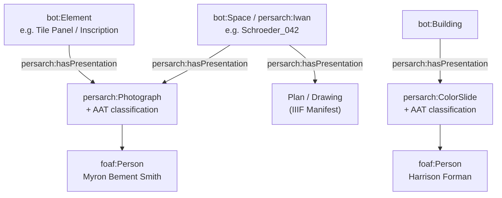
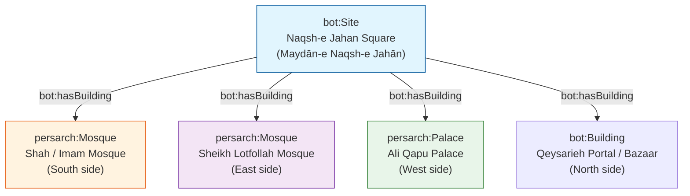
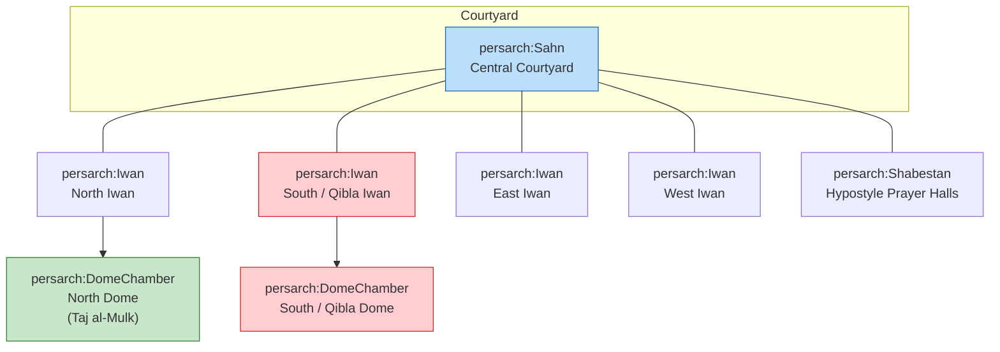
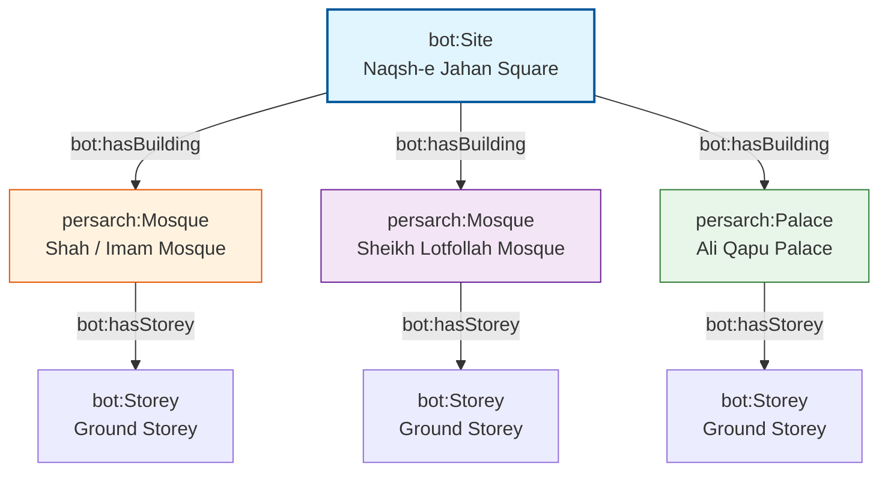

# Persian Architecture Ontology – BOT Extension Case Studies

**Extending the Building Topology Ontology (BOT) for Persian / Iranian Islamic Architecture**  
Focus: Masjid-i Jāmiʿ of Isfahan · Sheikh Lotfollah Mosque · Naqsh-e Jahan Square Ensemble

[](https://www.gnu.org/licenses/gpl-3.0)
[](https://www.w3.org/OWL/)
[-green)](https://w3c-lbd-cg.github.io/bot/)

---

## 1. Project Vision

This repository provides a practical, reusable extension of the **Building Topology Ontology (BOT)** tailored to the distinctive spatial, structural, decorative, and typological features of Persian architecture.  

It demonstrates how a minimal, standards-compliant topological core can be systematically enriched to support:

- Digital documentation of historic mosques, madrasas, caravanserais, and urban ensembles
- Knowledge-graph construction for cultural heritage
- SPARQL querying of spaces, elements, inscriptions, and motifs
- Integration with IIIF, GeoSPARQL (WKT), Getty AAT, and CIDOC-CRM / CRMtex
- Future AI / GraphRAG applications over architectural heritage data

The work follows a deliberate iterative strategy: start from BOT’s core classes and properties, then expand according to clear priorities and real case studies.

### Primary Case Studies

| Case Study | Type | Key Characteristics | Modelling Focus |
|------------|------|---------------------|-----------------|
| **Naqsh-e Jahan Square** | `bot:Site` | UNESCO World Heritage (1979). ~160 × 560 m. Safavid urban ensemble (1598–1629) under Shah Abbas I | Site-level containment, adjacency of multiple buildings |
| **Masjid-i Jāmiʿ (Friday / Great Mosque)** | Large multi-period `bot:Building` | Prototype four-iwan plan. Continuous construction from 8th–19th centuries. Eric Schroeder 1931 numbered plan | Hierarchical spaces, multi-phase complexity, numbered spatial inventory |
| **Sheikh Lotfollah Mosque** | Compact Safavid `bot:Building` | 1602/03–1618/19. Architect: Muhammad Reza Isfahani. Single rotated dome chamber, no courtyard, no minarets | Precise spatial sequence, qibla orientation, rich surface decoration |
| **Shah Mosque (Imam Mosque)** & **Ali Qapu Palace** | Additional buildings on the same Site | Public congregational mosque vs. royal pavilion | Typological contrast within one urban setting |

---

## 2. Background: Why Extend BOT?

The **Building Topology Ontology (BOT)** is a lightweight OWL ontology developed by the W3C Linked Building Data Community Group. It defines only the essential topological concepts needed to describe buildings:

**Core Classes**  
`bot:Zone` · `bot:Site` · `bot:Building` · `bot:Storey` · `bot:Space` · `bot:Element` · `bot:Interface`

**Key Properties**  
`bot:containsZone` (transitive) · `bot:hasBuilding` · `bot:hasStorey` · `bot:hasSpace`  
`bot:containsElement` · `bot:adjacentElement` · `bot:hasSubElement`  
`bot:adjacentZone` · `bot:intersectsZone` · `bot:interfaceOf`

BOT is deliberately minimal and designed for domain-specific extension through subclassing and sub-properties. Persian architecture requires additional concepts for:

- Building types (Mosque, Madrasa, Caravanserai, Palace)
- Characteristic spaces (Sahn / Courtyard, Iwan, Dome Chamber, Shabestan, Hujra, Pishtaq)
- Complex elements with internal structure (Mihrab, Minaret, Dome)
- Decorative systems (Tile panels, Floral / Arabesque patterns, Calligraphic inscriptions)
- Script styles (Thuluth, Kufic, …) and Quranic content
- Precise geometric placement (WKT / GeoSPARQL)
- Alignment with Getty AAT motifs and materials

This repository implements that extension under the namespace `persarch:` (Persian Architecture).

---

## 3. Ontology Extension Overview

### 3.1 High-Level Class Hierarchy


Separate visual Layer



### 3.2 Key Modelling Decisions

| Decision | Rationale |
|----------|-----------|
| Mihrab and Minaret as `bot:Element` | They are discrete architectural constituents with clear function and form. Complexity is captured via `bot:hasSubElement`. |
| Sub-elements for complex components | BOT explicitly supports `bot:hasSubElement` (e.g. wall hosts window). A minaret base, shaft, balcony, lantern, internal stair, and inscription bands are natural sub-elements. |
| Surface decorations as Elements | Tile panels, floral patterns, and inscriptions are attached to parent elements (walls, domes, mihrabs) and can carry their own geometry (WKT) and AAT alignments. |
| Numbered spaces from Schroeder plan | Preserve the original scholarly numbering as stable identifiers while mapping each number to a typed `persarch:` Space. |
| Site = Naqsh-e Jahan Square | Demonstrates multi-building urban topology while remaining fully BOT-compliant. |

---

## 4. Case Study 1 – Naqsh-e Jahan Square as `bot:Site`

**Historical context**  
Laid out under Shah Abbas I (construction period approximately 1598–1629). UNESCO World Heritage Site (inscribed 1979, criteria i, v, vi). Dimensions approximately 160 m × 560 m (area ≈ 89,600 m²).

**Major buildings on the Site**



This structure allows queries such as:  
“Return all mosques contained in the Naqsh-e Jahan Site” or “Find buildings adjacent to the Shah Mosque across the square.”

---

## 5. Case Study – Masjid-i Jāmiʿ of Isfahan (Friday Mosque) with Schroeder Numbers

### 5.1 Architectural Significance

- One of the oldest and most continuously evolved congregational mosques in Iran.
- Transformed under the Seljuks into the classic four-iwan courtyard plan that became the prototype for later Persian mosques.
- Contains two celebrated dome chambers: the southern qibla dome (associated with Nizam al-Mulk) and the northern dome (Taj al-Mulk, 1088–89).
- Later additions from Ilkhanid, Timurid, Safavid, and Qajar periods create a rich stratigraphy of styles and spaces.

### 5.2 Eric Schroeder’s 1931 Plan – A Pioneering Structural Inventory

In 1931 Eric Schroeder produced a meticulously numbered ground plan of the Masjid-i Jāmiʿ of Isfahan for the **American Institute for Persian Art and Archaeology**, the organisation closely associated with Arthur Upham Pope. The original drawing is preserved in the Ernst Herzfeld Papers at the National Museum of Asian Art Archives, Smithsonian Institution (Item D-704 / FSA A.06 05.0704). The verso caption reads: “Plan of MASJID-I-JAMI' of ISFAHAN. drawn by Eric Schroeder for the American Institute for Persian Art and Archaeology, 1931.”

This was not merely a conventional architectural survey drawing. By systematically numbering every space, bay, iwan, dome chamber, and secondary structure, Schroeder created what can be understood as an early form of **structured spatial data**. At a time when most documentation of Islamic architecture still relied on descriptive prose, selective photographs, or un-numbered sketches, the decision to assign unique identifiers to the constituent parts of this vast, multi-period complex was a conceptual leap. It implicitly treated the mosque as a system of discrete, referenceable units — exactly the kind of decomposition that modern topological ontologies (BOT and its extensions) formalise.

The intellectual value of this approach was quickly recognised. Later researchers, including Albert Gabriel (whose 1935 study of the mosque appeared in *Ars Islamica*) and especially Eugenio Galdieri (whose multi-volume IsMEO publications of the 1970s–1980s remain foundational), worked within and built upon the spatial framework that Schroeder and the Pope circle had established. The numbered plan became a shared reference that allowed successive generations of scholars to discuss individual spaces with precision rather than ambiguity.

In the present project we treat Schroeder’s numbering as a primary scholarly authority. Each numbered area is modelled as a `bot:Space` (or a more specific subclass such as `persarch:Iwan`, `persarch:DomeChamber`, or `persarch:Shabestan`) while the original number is retained as a stable identifier. This preserves the historical integrity of the 1931 survey and simultaneously converts it into machine-readable topological data.

**Embedding the original drawing**  
A published version of the plan is available on ArchNet:  
[https://www.archnet.org/sites/1621?media_content_id=62965](https://www.archnet.org/sites/1621?media_content_id=62965)  
(Title on ArchNet: “Isfahan. Friday Mosque. Plan. Schroeder.”)

**Toward a vector version**  
One of the longer-term goals is to produce a clean vector redrawing (SVG) that retains every original number as a discrete, selectable object that can be linked directly to `bot:Space` individuals.

### 5.3 Sample Instance Data – South Iwan and Southern Dome Chamber

The following Turtle illustrates the recommended pattern: Schroeder number as stable identifier, domain typing, adjacency, and illustrative WKT geometry (local coordinate system – replace with surveyed values later).

#### Classifying the Media Resources with AAT

Treat every photograph or slide as a first-class resource that can be typed and classified:

| Concept | Suggested AAT alignment | Notes |
|---------|-------------------------|-------|
| Black-and-white photograph | `aat:300128343` (black-and-white photographs) or broader `aat:300046300` (photographs) | Myron Bement Smith material |
| Color slide | `aat:300128359` (color slides) | Harrison Forman material |
| Architectural photograph | Can combine with subject terms | |
| Subject matter | Use AAT for “inscriptions”, “tilework”, “arabesques / floral patterns”, “iwans”, etc. | Enables cross-collection discovery |

Agents (photographers) become reusable nodes:

- `Myron Bement Smith` (1897–1970) — major documentation of the Masjid-i Jāmiʿ, including detailed views of the Qibla iwan.
- `Harrison Forman` (1904–1978) — 1967 colour slides of the Great Mosque and related Isfahan monuments (many already have IIIF manifests at UWM Libraries).


```turtle
@prefix bot:      <https://w3id.org/bot#> .
@prefix persarch: <https://w3id.org/persian-architecture#> .
@prefix geo:      <http://www.opengis.net/ont/geosparql#> .
@prefix rdfs:     <http://www.w3.org/2000/01/rdf-schema#> .
@prefix xsd:      <http://www.w3.org/2001/XMLSchema#> .
@prefix dcterms:  <http://purl.org/dc/terms/> .

persarch:hasPresentation a owl:ObjectProperty ;
    rdfs:label "has presentation"@en ;
    rdfs:comment "Links any architectural zone or element to an IIIF Presentation resource (Manifest or Canvas) that depicts or documents it."@en ;
    rdfs:domain bot:Zone ;          # or a union of bot:Zone and bot:Element
    rdfs:range  persarch:PresentationResource .

# Optional, more precise sub-properties (use if you want stronger semantics)
persarch:hasPlanPresentation     rdfs:subPropertyOf persarch:hasPresentation .
persarch:hasPhotographPresentation rdfs:subPropertyOf persarch:hasPresentation .
persarch:hasSlidePresentation    rdfs:subPropertyOf persarch:hasPresentation .

:Masjid_i_Jami a persarch:Mosque , bot:Building ;
    rdfs:label "Masjid-i Jāmiʿ of Isfahan"@en ;
    rdfs:label "مسجد جامع اصفهان"@fa ;
    dcterms:description "The Friday Mosque of Isfahan (Great Mosque). Multi-period complex documented in Eric Schroeder’s 1931 numbered plan."@en .

# South / Qibla Iwan (illustrative Schroeder number 42)
:Schroeder_042 a persarch:Iwan , bot:Space ;
    rdfs:label "South Iwan (Qibla Iwan)"@en ;
    rdfs:label "ایوان جنوبی (ایوان قبله)"@fa ;
    persarch:schroederNumber "42"^^xsd:string ;
    rdfs:comment "Main qibla-oriented iwan on the southern side of the central courtyard. Numbered 42 on Eric Schroeder’s 1931 plan."@en ;
    bot:adjacentZone :Schroeder_055 ;
    geo:hasGeometry :Geom_Schroeder_042 ;
    dcterms:source <https://www.archnet.org/sites/1621?media_content_id=62965> ;
    dcterms:source <https://www.si.edu/object/archives/components/sova-fsa-a-06-ref24401> .

:Geom_Schroeder_042 a geo:Geometry ;
    geo:asWKT """POLYGON((45.2 12.8, 58.7 12.8, 58.7 28.4, 45.2 28.4, 45.2 12.8))"""^^geo:wktLiteral ;
    rdfs:comment "Illustrative WKT in a local metric coordinate system. Replace with accurate surveyed coordinates."@en .

# Southern Dome Chamber
:Schroeder_055 a persarch:DomeChamber , bot:Space ;
    rdfs:label "Southern Dome Chamber (Qibla Dome)"@en ;
    rdfs:label "گنبدخانه جنوبی (گنبد قبله)"@fa ;
    persarch:schroederNumber "55"^^xsd:string ;
    rdfs:comment "The main southern dome chamber behind the qibla iwan."@en ;
    bot:adjacentZone :Schroeder_042 ;
    geo:hasGeometry :Geom_Schroeder_055 .

:Geom_Schroeder_055 a geo:Geometry ;
    geo:asWKT """POLYGON((46.1 28.4, 57.9 28.4, 57.9 41.6, 46.1 41.6, 46.1 28.4))"""^^geo:wktLiteral .

:Masjid_i_Jami bot:hasSpace :Schroeder_042 , :Schroeder_055 .

# A vintage B&W photograph by Myron Bement Smith
:Photo_Smith_Qibla_Iwan_Tiles a persarch:Photograph , foaf:Document ;
    rdfs:label "Detail of tilework and inscriptions, Qibla Iwan, Masjid-i Jāmiʿ"@en ;
    dcterms:creator :Myron_Bement_Smith ;
    dcterms:date "1930s" ;                     # approximate; refine when known
    aat:300128343 aat:300128343 ;              # black-and-white photographs
    # subject classification
    dcterms:subject aat:300010206 ;            # arabesques (example)
    dcterms:subject aat:300028704 ;            # inscriptions (or more precise term)
    persarch:depicts :Schroeder_042 ;
    # IIIF link
    persarch:hasIIIFManifest <https://example.org/iiif/smith-qibla-iwan/manifest.json> ;
    # or directly a Canvas if preferred

# A colour slide by Harrison Forman (real IIIF example exists at UWM)
:Slide_Forman_Great_Mosque a persarch:ColorSlide , foaf:Document ;
    rdfs:label "Great Mosque of Isfahan (Masjid-i Juma), 1967"@en ;
    dcterms:creator :Harrison_Forman ;
    dcterms:date "1967"^^xsd:gYear ;
    aat:300128359 aat:300128359 ;              # color slides
    persarch:depicts :Masjid_i_Jami ;
    persarch:hasIIIFManifest <https://collections.lib.uwm.edu/iiif/info/agsphoto/34594/manifest.json> .

# Linking from the space/building back to the media
:Schroeder_042 persarch:hasPhotographPresentation :Photo_Smith_Qibla_Iwan_Tiles .
:Masjid_i_Jami   persarch:hasSlidePresentation :Slide_Forman_Great_Mosque .

# Agents (reusable nodes)
:Myron_Bement_Smith a foaf:Person ;
    rdfs:label "Myron Bement Smith"@en ;
    foaf:birthDate "1897" ;
    foaf:deathDate "1970" .

:Harrison_Forman a foaf:Person ;
    rdfs:label "Harrison Forman"@en ;
    foaf:birthDate "1904" ;
    foaf:deathDate "1978" .

```

### 5.4 Four-Iwan Spatial Organisation (Simplified)



---

## 6. Case Study – Naqsh-e Jahan Square as a Large 3D Site

Naqsh-e Jahan Square is modelled as a single `bot:Site` that contains three major buildings. Each building is given at least one `bot:Storey` (Ground Storey) that in turn contains its principal spaces. This demonstrates multi-building urban topology while remaining fully BOT-compliant and ready for later 3D enrichment.

### 6.1 Site Hierarchy Overview



### 6.2 Sample Instance Data – Site + Three Buildings with Ground Storeys

```turtle
@prefix bot:      <https://w3id.org/bot#> .
@prefix persarch: <https://w3id.org/persian-architecture#> .
@prefix rdfs:     <http://www.w3.org/2000/01/rdf-schema#> .
@prefix dcterms:  <http://purl.org/dc/terms/> .
@prefix geo:      <http://www.opengis.net/ont/geosparql#> .

#################################################################
# The Site
#################################################################

:Naqsh_e_Jahan_Square a bot:Site ;
    rdfs:label "Naqsh-e Jahan Square"@en ;
    rdfs:label "میدان نقش جهان"@fa ;
    dcterms:description "UNESCO World Heritage Site (1979). Safavid urban ensemble laid out under Shah Abbas I (approx. 1598–1629). Dimensions ~160 × 560 m."@en ;
    bot:hasBuilding :Shah_Mosque ,
                    :Sheikh_Lotfollah_Mosque ,
                    :Ali_Qapu_Palace .

#################################################################
# 1. Shah Mosque (Imam Mosque) – South side
#################################################################

:Shah_Mosque a persarch:Mosque , bot:Building ;
    rdfs:label "Shah Mosque (Imam Mosque)"@en ;
    rdfs:label "مسجد شاه (مسجد امام)"@fa ;
    bot:hasStorey :Shah_Ground_Storey .

:Shah_Ground_Storey a bot:Storey ;
    rdfs:label "Ground Storey – Shah Mosque"@en ;
    bot:hasSpace :Shah_Sahn ,
                 :Shah_South_Iwan ,
                 :Shah_Dome_Chamber .

:Shah_Sahn a persarch:Sahn , bot:Space ;
    rdfs:label "Central Courtyard (Sahn)"@en .

:Shah_South_Iwan a persarch:Iwan , bot:Space ;
    rdfs:label "South / Qibla Iwan"@en ;
    bot:adjacentZone :Shah_Dome_Chamber .

:Shah_Dome_Chamber a persarch:DomeChamber , bot:Space ;
    rdfs:label "Main Dome Chamber"@en .

#################################################################
# 2. Sheikh Lotfollah Mosque – East side
#################################################################

:Sheikh_Lotfollah_Mosque a persarch:Mosque , bot:Building ;
    rdfs:label "Sheikh Lotfollah Mosque"@en ;
    rdfs:label "مسجد شیخ لطف‌الله"@fa ;
    bot:hasStorey :Lotfollah_Ground_Storey .

:Lotfollah_Ground_Storey a bot:Storey ;
    rdfs:label "Ground Storey – Sheikh Lotfollah"@en ;
    bot:hasSpace :Lotfollah_Portal ,
                 :Lotfollah_Corridor ,
                 :Lotfollah_Dome_Chamber .

:Lotfollah_Portal a persarch:PishtaqSpace , bot:Space ;
    rdfs:label "Entrance Portal (Pishtaq)"@en .

:Lotfollah_Corridor a bot:Space ;
    rdfs:label "Twisting Corridor (re-orientation sequence)"@en ;
    rdfs:comment "Corridor that rotates the visitor approximately 45° then 90° to align the prayer hall with the qibla."@en .

:Lotfollah_Dome_Chamber a persarch:DomeChamber , bot:Space ;
    rdfs:label "Main Prayer Hall / Dome Chamber"@en ;
    rdfs:comment "Single domed chamber (~19 m side). No courtyard, no minarets."@en .

#################################################################
# 3. Ali Qapu Palace – West side
#################################################################

:Ali_Qapu_Palace a persarch:Palace , bot:Building ;
    rdfs:label "Ali Qapu Palace"@en ;
    rdfs:label "عالی‌قاپو"@fa ;
    bot:hasStorey :AliQapu_Ground_Storey .

:AliQapu_Ground_Storey a bot:Storey ;
    rdfs:label "Ground Storey – Ali Qapu"@en ;
    bot:hasSpace :AliQapu_Entrance_Hall ,
                 :AliQapu_Reception .

:AliQapu_Entrance_Hall a bot:Space ;
    rdfs:label "Entrance Hall / Portal zone"@en .

:AliQapu_Reception a bot:Space ;
    rdfs:label "Ceremonial / Reception spaces"@en .
```

This structure is deliberately minimal yet complete. It can be expanded later with additional storeys (Ali Qapu is multi-storey), more detailed spaces, elements (mihrabs, minarets, tile panels), and real geometric data.

---

## 7. Decorative Layer – Patterns, Inscriptions & AAT

Surface decorations are modelled as subclasses of `bot:Element` so they can be attached to parent elements and carry their own geometry and controlled vocabulary links.

**Core classes**  
`persarch:SurfaceDecoration` · `persarch:TilePanel` · `persarch:FloralPattern` · `persarch:Inscription`

**Key properties**  
- `persarch:decorates` / `persarch:locatedOn`  
- `persarch:hasScriptStyle` (Thuluth, Kufic, …)  
- `persarch:hasText` + `persarch:referencesQuranicVerse`  
- `persarch:hasMotifType` → Getty AAT  
- `persarch:hasSurfaceGeometry` → GeoSPARQL / WKT  

---

## 8. Repository Structure (Recommended)

```
persian-architecture-bot-case-studies/
├── ontology/
│   ├── persarch.ttl
│   ├── alignments/
│   └── shapes/
├── data/
│   ├── naqsh-e-jahan-site.ttl
│   ├── masjid-i-jami.ttl          # Schroeder-numbered spaces
│   ├── sheikh-lotfollah.ttl
│   ├── shah-mosque.ttl
│   └── ali-qapu.ttl
├── queries/
│   └── competency-questions.rq
├── docs/
│   └── modelling-decisions.md
├── media/
│   └── (plans, images, vector SVG)
└── README.md
```

---

## 9. Competency Questions

1. Which buildings are contained in the Naqsh-e Jahan Site?  
2. List all spaces of type `persarch:Iwan` in the Masjid-i Jāmiʿ together with their Schroeder numbers.  
3. What is the spatial sequence from the portal of Sheikh Lotfollah Mosque to its dome chamber?  
4. Which spaces are adjacent to the South Iwan of the Friday Mosque?  
5. Retrieve geometries (WKT) of selected spaces.  
6. Find all buildings that have a Ground Storey containing a `persarch:DomeChamber`.

---

## 10. Data Sources & Scholarly Grounding

- Eric Schroeder, Plan of Masjid-i Jāmiʿ of Isfahan, 1931 (American Institute for Persian Art and Archaeology). Smithsonian Institution, Ernst Herzfeld Papers, D-704.  
- ArchNet media: https://www.archnet.org/sites/1621?media_content_id=62965  
- UNESCO World Heritage documentation for Naqsh-e Jahan Square (Reference 115).  
- BOT specification: https://w3c-lbd-cg.github.io/bot/  
- Getty Art & Architecture Thesaurus (AAT).

---

## 11. Next Steps & Enrichment Path

1. Formalise the full `persarch.ttl` ontology module.  
2. Expand the instance data with more Schroeder-numbered spaces and complete sequences for Sheikh Lotfollah.  
3. Add real geometric data (vector plan + surveyed WKT).  
4. Link historic photographs, plans, and IIIF manifests.  
5. Introduce decorative elements, inscriptions, and AAT alignments.  
6. Create SPARQL query library and NotebookLM-friendly documentation.

After this foundational version is stable we can discuss concrete strategies for enriching the model with high-resolution plans, images, slides, and measured drawings.

---

## 12. License

This repository is released under the **GNU General Public License v3.0**.

**Suggestion regarding licensing**  
GPL-3.0 is excellent for the software and ontology components (ensuring derivative works remain open). For pure documentation, images, and scholarly data, some projects dual-license or apply a Creative Commons license (e.g. CC BY 4.0) to the non-code parts so that the material can be more easily reused in publications, teaching materials, and NotebookLM-style tools without the copyleft obligations of GPL.  

A practical approach is:
- Ontology + instance data + scripts → GPL-3.0  
- README, diagrams, and explanatory text → CC BY 4.0 (or keep everything under GPL-3.0 for simplicity)

Either choice is valid; the important point is to state it clearly in the repository.

---

## 13. Citation

If you use this work, please cite the repository and acknowledge the underlying scholarly sources (especially Schroeder’s 1931 plan and the UNESCO documentation of Naqsh-e Jahan Square).

---

**Status**: Active development – foundational modelling and first detailed case-study instances complete.  
**Maintainer**: [Your GitHub handle]  
**License**: GNU General Public License v3.0

This repository is intended both as a practical tool for digital cultural heritage and as a clear, diagram-rich source that tools such as Google NotebookLM can use to generate slide decks and infographics about the extension of BOT to Persian architecture.
